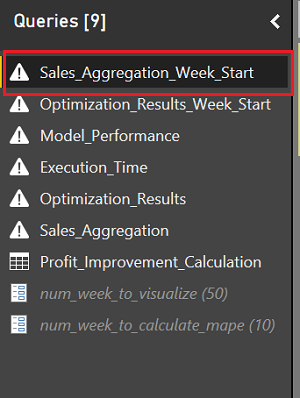
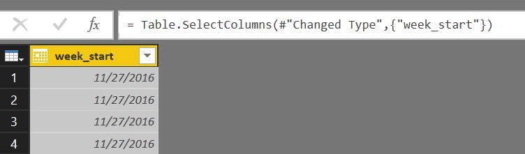
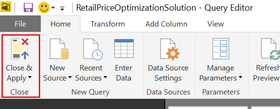
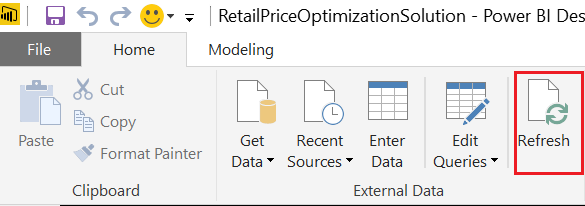

# Demand Forecasting and Price Optimization for Retail 

## Abstract
This document is focusing on the post deployment instructions for the automated deployment through [Cortana Intelligence Solutions](https://gallery.cortanaintelligence.com/solutions). The source code of the solution as well as manual deployment instructions can be found [here](https://github.com/Azure/cortana-intelligence-price-optimization-for-retail/tree/master/Manual%20Deployment%20Guide).

## Monitor Progress
Once the solution is deployed to the subscription, you can see the services deployed by clicking the resource group name on the final deployment screen in the CIS.

This will show all the resources under this resource groups on [Azure management portal](https://portal.azure.com/).

After successful deployment, the entire solution is automatically started on cloud. You can monitor the progress from the following resources.
This part contains instructions for managing different Azure componenets in the deployed solution.
### Web Jobs
A web job is created during the deployment. You can monitor the web job by clicking the link on your deployment page. This web job will generate weekly sales data hourly. The generated sales data will be stored in **Azure Data Lake Store**.
> **Note**: In the demo here, the simulator will generate **one week's** simulated data in **one hour**. And **Azure Data Factory** is scheduled to process, and output the results for **one week's** data **in one hour**. 
 That is to say, in this solution demo, one week is condensed to one hour. In this case, you are able to view multiple weeks' results in a few hours, rather than waiting for multiple weeks to get the results for a few weeks. However, in the reality deployment, the cycle time should be consistent with the real time.

### Azure Data Factory
**Azure Data Factory** is used to orchestrate and schedule the entire data flow. In this solution, it is mainly used to schedule the data aggregation, demand forecasting and price optimization. Here is an overview of the ADF pipelines. You can monitor the data pipelines by clicking the link on your deployment page.

Here is an overview of the generated ADF pipelines.

**RetailDFModel_PriceOptimizationPipeline**: In each cycle, Spark activities will ingest the raw data from Azure Data Lake Store, aggregate the raw unstructured transaction data to weekly sales data, train demand forecasting model, solve price optimization problems and prepare the data for Power BI visualization.

**ModelRetrainPipeline**: Demand forecasting model is retrained on up-to-date sales data to keep improving the predictive performance. The **ModelRetrainPipeline** can be deployed in a different cycle time from the two pipelines above, since there are no dependencies between **ModelRetrainPipeline** and **RetailDFModel_PriceOptimizationPipeline**. In this solution demo, the **RetailDFModel_PriceOptimizationPipeline** are scheduled to run **hourly**, which represents **weekly** in the reality. While **ModelRetrainPipeline** is scheduled to run **every four hours**, which represents **four weeks (approximately one month)** in the reality.

### Azure Data Lake Store
Both raw data and analytical results are saved in **Azure Data Lake Store** in this solution. You can monitor the generated datasets by clicking the link on your deployment page.

There are mainly two final result datasets: **Aggregated Sales Data** and **Optimization Result Data**. Each record of **Aggregated Sales Data** contain weekly sales, product features and store features for one product sold at one store in a specific week. Each record of **Optimization Result Data** contain predicted weekly sales on this record's features, recommended optimal price, product features and store features for one product sold at one store in a specific week. **Aggregated Sales Data** only contain historical data, whereas **Optimization Result Data** contain historical recommendations as well as the future price recommendation for the coming week. **Aggregated Sales Data** contain records for all stores, whereas **Optimization Result Data** only contain records for stores in treatment group, because only stores in treatment group accepts/needs the recommended price from optimization algorithm.

For both **Aggregated Sales Data** and **Optimization Result Data**, the solution produces result datasets in [**Parquet file**](<http://parquet.apache.org/>) format, which is a columnar storage format in the Hadoop ecosystem. The **Parquet files** can be access by sql query, using `%%sql` magic in **Jupyter Notebook** pre-installed on HDinsight Spark Cluster. 

#### [Optional] How to Access Parquet Files
 The **Parquet file** results for **Aggregated Sales Data** and **Optimization Result Data** are respectively in folder **aggregated_sales_data** and **opt_results_data**. They are both partitioned by week and the name for each partition indicates the start date of the corresponding week.
 To access them in **Jupyter Notebook** on HDinsight Spark Cluster, please:
   - Navigate to ***portal.azure.com*** and log in to your account.
   - On the left tab click Resource Groups.
   - Click on the resource group created by the deployable solution.
   - Click on the HDInsight Spark Cluster we created in step 4.
   - Click **Cluster Dashboards** under **Quick Links** session, and click on **Jupyter Notebook** on the popped-out blade.
   - On the popped-out window, enter Cluster Login Username and Cluster Login Password recorded in step 4. After authentication, you will see the **jupyter notebook** for the HDInsight Spark cluster launched.
   - Click on **Upload** on the top right. Download the [GIT repo](<https://github.com/Azure/cortana-intelligence-price-optimization-for-retail.git>). Browse to the *Automated Deployment Guide\Validation Results PySpark Code* folder inside the downloaded GIT repo, and select **Sql_Query_on_Parquet_Files_Example.ipynb**. Then, click **upload** to upload the script.
   - Click on **Sql_Query_on_Parquet_Files_Example.ipynb** to open the example notebook, which contains a toy example of how to run sql query against the Parquet file versions of the two result datasets.
   - Replace the adl_name <Azuredatalakestore-Name> on the line 1 of the first cell with the one created in this solution.
   - Click on the first cell, and Click **Cell** on the top and select **Run Cells**. The codes in the first cell will ingest the two Parquet files and register them as temporary tables.
   - Then use the same way to run the second and third cell. Any cells using [`%%sql` magic](<https://docs.microsoft.com/en-us/azure/hdinsight/hdinsight-apache-spark-jupyter-notebook-kernels#parameters-supported-with-the-sql-magic>) are able to run the **SQL queries** on the registerd temporary tables. You can write your own customized queries for post analysis. The sample SQL queries select the first 10 records in the **Aggregated Sales Data** and **Optimization Result Data**, and you can also see various visualization of the query result by choosing a different **Type** other than **Table**.

### Apache Spark for Azure HDInsight
In this solution, **Spark on HDInsight** is used to ingest and preprocess the raw data, build and retrain the demand forecasting models, and execute price optimization algorithms. You can monitor the Spark jobs submitted via **Azure Data Factory** by clicking the link on your deployment page.

## Visualization
### Requirements
You will need the following accounts and software to create Power BI visualization:
- A Microsoft Office 365 subscription for Power BI access
- A network connection
- [Power BI Desktop](<https://powerbi.microsoft.com/en-us/desktop>)

### Setup Power BI

The essential goal of this part is to visualize the results from the retail price optimization solution. Power BI can directly connect to the Hive tables created by Spark activities, where the results are stored.
> **Note**:  1) In this step, the prerequisite is to download and install the free software [Power BI desktop](https://powerbi.microsoft.com/desktop). 2) We recommend you start this process 2-3 hours after you finish deploying the ADF pipelines so that you have more data points to visualize. 3) The mape (mean average percentage error) of the demand forecasting model can be high at the very first several round, and it will goes down as more rounds of data are available for model training.

#### 1.	Download the Power BI report file and sign-in 

-  Make sure you have installed the latest version of [Power BI desktop](https://powerbi.microsoft.com/desktop).
-	In this GitHub repository, you can download the **'RetailPriceOptimizationSolution.pbix'** file under the folder [*Power BI*](https://github.com/Azure/cortana-intelligence-retail-price-optimization/tree/master/Automated%20Deployment%20Guide/Power%20BI) and then open it. 

> **Note:** If you see an error massage, please make sure you have installed the latest version of Power BI Desktop.

- After opening the **'RetailPriceOptimizationSolution.pbix'** file, you might see message saying "There are pending changes in your queries that haven't been applied.". Please **DO NOT** Apply Changes since the data source has not been updated yet. 

> **Note:** The visualizations that you see now in your Power BI report are the cached results from a previous demo deployment, rather than the real data in your deployment. You will see the visualizations that corresponds to the data sitting under your subscription after you follow the below steps to change the data connection to your own Spark cluster. 

-	Sign in by clicking **’Sign in’** on the top-left corner. Note: You must have a Microsoft Office 365 subscription for Power BI access.

-	Click on **’Edit Queries’** on the top and open the query editor. You will see 9 Queries in the left pane of the query editor. You might also see an error message saying "DataFormat.Error: Invalid URI: The hostname could not be parsed.
". Please ignore this error message for now and follow the below instructions for updating the data source. Once the data source is updated, the error will gone.

#### 2.	Update the Azure HDInsight account in the Power BI file

-	Click on **’Sales_Aggregation_Week_Start’** query and you will see that this query is highlighted in a darker color as the following screenshot. Then, click on the **’Advanced Editor’** on the top, which is next to the **’Refresh Preview’**.

-	On the popped-out Advanced Editor window, replace the **\<cluster-name>** on the first line with the name of the Azure HDInsight Spark Cluster that created by the deployable solution. 
- Then, click **’Done’** on the bottom-right corner of the Advanced Editor window.
- You will be asked to enter the credentials for the Spark cluster. Click on **’Edit Credentials’** and enter the Cluster Login Username and Cluster Login Password for the Spark cluster created by the deployed solution.
-	If the connection is successful, you can see the data appears similar as the following snapshot. If you see an error message saying "Expression. Error: The key didn't match any rows in the table", please click on the **’Refresh Preview’** on the top to refresh the preview of the data. 

-	Repeat the above steps that you did for **’Sales_Aggregation_Week_Start’** query (click on the corresponding query, open the corresponding advanced query editor and replace the **\<cluster-name>** with your cluster name) on the following 5 other queries: **’ Optimization_Results_Week_Start’** query, **’ Model_Performance’** query, **’ Execution_Time’** query, **’ Optimization_Results’** query, **’ Sales_Aggregation’** query. 
-	Click on **’Close & Apply’** on the top-left, and you will see the visualization report in Power BI Desktop. 

-	[Optional] You can click on **’Refresh’** on the top anytime you want to refresh the report, when there are new data comes in.

#### 3)	[Optional] Publish the dashboard to [Power BI online](http://www.powerbi.com/)

Note that this step needs a Power BI account (or Office 365 account).
-	 Click **’Publish’** on the top panel. Choose **'My Workspace'** (or other workspaces where you wish to publish the dashboard) and few seconds later a window appears displaying "Publishing succeeded".
-	Click the link "Open 'RetailPriceOptimizationSolution.pbix' in Power BI" on the screen to open it in a browser. 
-	On the navigation pane, go to the **’Reports’** section, click on **’ RetailPriceOptimizationSolution’**. Click on **’Pin Live Page’** on the top. On the popped-out window, choose **’New Dashboard’**, and put the name of the new dashboard, e.g RetailPriceOptimizationSolution, and click on **’Pin Live’**.
-	On the navigation pane, go to the **’Dashboards’** section, click on **’ RetailPriceOptimizationSolution’**. Click the three dots on the top-right of the dashboard tile (the red one). Click on the middle pencil icon to edit the tile details. In **’Functionality’**, check **’Display last refresh time’**, and click on **’Apply’**. You will see the last refresh time showing up on the top-left of the dashboard.

## Scaling
The architecture of this solution is designed to be scalable. [Azure Data Lake Store](https://azure.microsoft.com/en-us/services/data-lake-store/) can scale throughput to support any size of analytic workload without redesigning your application or repartitioning your data at higher scale. Apache Spark for Azure HDInsight, either existing clusters or new ones, can also be scaled up to fit into heavier computation needs. 

## Customization
For solution customization, you can refer to the manual deployment guide offered [here](<https://github.com/Azure/cortana-intelligence-price-optimization-for-retail/tree/master/Manual%20Deployment%20Guide>) to gain an inside view of how the solution is built, the function of each component and access to all the source codes used in the demo solution. You can customize the components accordingly to satisfy the business needs of your organization. Or you can [connect with one of our partners](http://aka.ms/CISFindPartner) for more information on how to tailor Cortana Intelligence to your needs.

##### Disclaimer
©2016 Microsoft Corporation. All rights reserved.  This information is provided "as-is" and may change without notice. Microsoft makes no warranties, express or implied, with respect to the information provided here.  Third party data was used to generate the solution.  You are responsible for respecting the rights of others, including procuring and complying with relevant licenses in order to create similar datasets.
