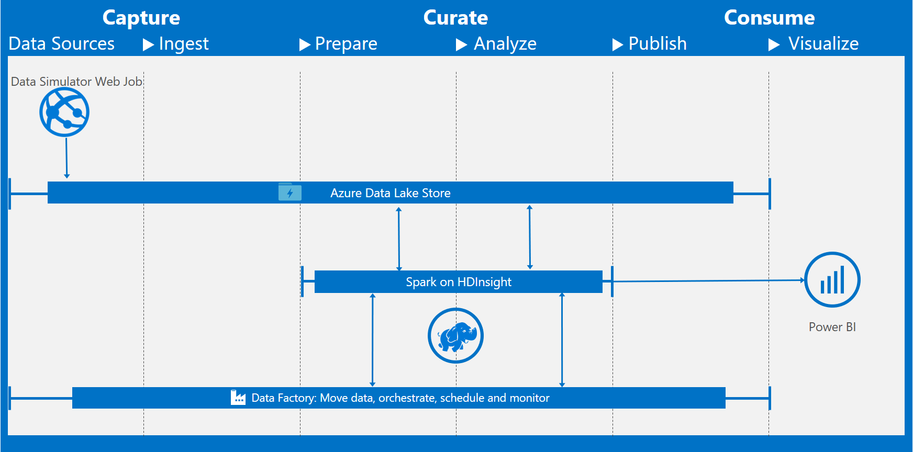

# Demand Forecasting and Price Optimization for Retail 

## Abstract
This **Automated Deployment Guide** contains the post-deployment instructions for the deployable **Demand Forecasting and Price Optimization for Retail** solution in the Cortana Intelligence Gallery. 

<Guide type="PostDeploymentGuidance" url="https://github.com/Azure/cortana-intelligence-price-optimization-for-retail/blob/master/Automated%20Deployment%20Guide/Post%20Deployment%20Instructions.md"/>

## Summary
<Guide type="Summary">
While pricing is recognized as a pivotal determinant of success in the retail industry, it is also one of the most challenging merchandising tasks. Retailers face many challenges when choosing pricing strategies to maximize profit, including accurately forecasting financial impact of potential pricing tactics, taking reasonable consideration of core business constraints, and fairly validating the executed pricing decisions. Expanding product offerings add further computational requirements to make in-time pricing decisions, compounding the difficulty of this already overwhelming task.

The solution provided here addresses the challenges raised above by utilizing historical transaction data to train a demand forecasting model that predicts the impact of store, department, brand, and product attributes on demand and sales rates. Pricing of products in a competing group is also incorporated to predict cross product impact such as cannibalization. A price optimization algorithm can then employ the model to forecast demand at various candidate price points while considering business constraints such as feasible price ranges, and choose the combination which maximizes profit. An experiment on store level is designed to evaluate algorithm performance, compared to the alternate pricing strategy. The whole process described above is operationalized and deployed in the Cortana Intelligence Suite.

This solution will enable retailers to ingest historical transaction data, predict future demand, and obtain optimal pricing recommendations on a regular basis, consequently improving profitability and reducing the time and effort required for pricing tasks.
</Guide>

## Prerequisites
<Guide type="Prerequisites">
* This pattern requires creation of **1 HDInsight Cluster with 16 cores** and **1 Data Lake Store**. Ensure adequate HDInsight quotas and Data Lake Stores are available before provisioning. By default one subscription can create a maximum of 20 core cluster. 
The limit can be increased. Please consider deleting any unused HDInsight Cluster and Data Lake Store from your subscription. You may contact [Azure Support](https://azure.microsoft.com/support/faq/) if you need to increase the limit. 

* This pattern requires user to have admin or owner privilege in order to create Service Principal in later steps during solution deployment. Check your account permissions using the document [Required permissions](https://docs.microsoft.com/en-us/azure/azure-resource-manager/resource-group-create-service-principal-portal#required-permissions).  It also requires PowerShell to create Service Principal. Access to the latest [Azure PowerShell](http://aka.ms/webpi-azps) to run (CLI) commands.   

* For now, the PowerShell script used in this pattern is supported only by Windows machine. If you have a Windows machine, please proceed with deployment, else consider installing a Windows VM to run the script. Use [Deploy Windows VM](https://github.com/Azure/azure-quickstart-templates/tree/master/101-vm-simple-windows) to deploy a Windows VM. 
</Guide>

## Description

#### Estimated Provisioning Time: <Guide type="EstimatedTime">40 Minutes</Guide>
<Guide type="Description">
The Cortana Intelligence Suite provides advanced analytics tools through Microsoft Azure — data ingestion, data storage, data processing and advanced analytics components — all of the essential elements for building an demand forecasting and price optimization for retail solution.

This solution combines several Azure services to provide powerful advantages. Azure Data Lake Store stores the weekly raw sales data. Apache Spark for Azure HDInsight ingests the data and executes data preprocessing, forecasting modeling and price optimization algorithms. Finally, Data Factory orchestrates and schedules the entire data flow.

The 'Deploy' button will launch a workflow that will deploy an instance of the solution within a Resource Group in the Azure subscription you specify. The solution includes multiple Azure services (described below) along with a web job that simulates data so that immediately after deployment you have a working end-to-end solution. 

## Solution Diagram

## Technical details and workflow
1.	The simulation data is generated hourly by newly deployed **Azure Web Jobs**.

2.	This synthetic data is stored at **Azure Data Lake Store**, that will be used in the rest of the solution flow.

3.	**Spark on HDInsight** is used to ingest and preprocess the raw data, build and retrain the demand forecasting models, and execute price optimization algorithms. 

6. **Azure Data Factory** orchestrates and schedules the entire data flow.

7.	Finally, **Power BI** is used for results visualization, so that users can monitor the results of the sales, predicted future demand as well as recommended optimal prices for a variety of products sold in different stores.
</Guide>
##### Disclaimer
©2017 Microsoft Corporation. All rights reserved.  This information is provided "as-is" and may change without notice. Microsoft makes no warranties, express or implied, with respect to the information provided here.  Third party data was used to generate the solution.  You are responsible for respecting the rights of others, including procuring and complying with relevant licenses in order to create similar datasets.