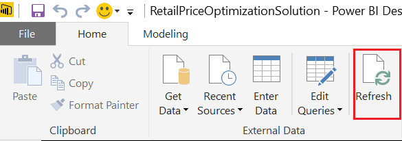

# Demand Forecasting and Price Optimization for Retail 

## Table of Contents  
- [Abstract](#abstract)  
- [Requirements](#requirements)
- [Architecture](#architecture)
- [Setup Steps](#setup-steps)
- [Validation and Results](#validation-and-results)
- [Delete the Solution](#delete-the-solution)

## Abstract

This **Manual Deployment Guide** explains how to build the **Demand Forecasting and Price Optimization for Retail** step by step. Going through this manual deployment process will help implementers gain an inside view of how the solution is built and the function of each component.

## Requirements

You will need the following accounts and software to create this solution:

- Source code and instructions from this GitHub repo (Download/Clone)

- A [Microsoft Azure subscription](<https://azure.microsoft.com/>) 

- A Microsoft Office 365 subscription for Power BI access

- A network connection

- [Microsoft Azure Storage Explorer](<http://storageexplorer.com/>)

- [Power BI Desktop](<https://powerbi.microsoft.com/en-us/desktop>)

It will take about four to five hours to implement this solution if you have all the required software/resources ready to use. 

## Architecture 


The figure above shows the overall architecture of the Retail Price Optimization solution. Here is the explanation :

- **Data Sources** : The solution uses a Web Job for generating simulated retail data. This application runs on Azure Web Apps and writes the raw data on Azure Data Lake Store. 

- **Ingest** and **Prepare** : A Spark job reads the raw data from Azure Data Lake Storage and processes/prepares it for the next steps

- **Analyze** : It has two parts :
  - First Spark Job uses the processed data to train the Retail Demand Forecasting model
  - Second Spark Job solves the Price Optimization problems and outputs the recommended optimal prices  

- **Publish** : The results of both Retail Demand Forecasting and Price Optimization are stored on Azure Data Lake Store

- **Visualize** : Power BI is linked to Apache Spark in Azure HDInsight to visualize the results

- **Pipeline Scheduling** : Azure Data Factory is used to create and schedule the pipelines involving all the above mentioned activities


## Setup Steps
This section walks the readers through the creation of each of the Cortana Intelligence Suite services in the architecture defined in Figure 1.
As there are usually many interdependent components in a solution, Azure Resource Manager enables you to group all Azure services in one solution into a [resource group](https://azure.microsoft.com/en-us/documentation/articles/resource-group-overview/#resource-groups). Each component in the resource group is called a resource.
We want to use a common name for the different services we are creating. The remainder of this document will use the assumption that the base service name is:

retailtemplate\[UI\]\[N\]

Where \[UI\] is the users initials and N is a random integer that you choose. Characters must be entered in in lowercase. Several services, such as Azure Storage, require a unique name for the storage account across a region and hence this format should provide the user with a unique identifier.
So for example, Steven X. Smith might use a base service name of *retailtemplatesxs01*  

> **NOTE:** We create most resources in the South Central US region. The resource availability in different regions depends on your subscription. When deploying you own resources, make sure all data storage and compute resources are created in the same region to avoid inter-region data movement. Azure Resource Group and Azure Data Factory don’t have to be in the same region as the other resources. Azure Resource Group is a virtual group that groups all the resources in one solution. Azure Data Factory is a cloud-based data integration service that automates the movement and transformation of data. Data factory orchestrates the activities of the other services. Use same subscription to deploy all the mentioned resources.

In the below steps, following Azure resources will be created under your subscription: Azure Storage Account, Azure Data Lake Store, Azure HDInsight Spark Cluster, Azure Web Apps and Azure Data Factory. And related configurataion instructions are also provided to build the above components as an end-to-end solution.

### 1. Create a new Azure Resource Group

  - Navigate to ***portal.azure.com*** and log in to your account

  - On the left tab click ***Resource Groups***
  
  - In the resource groups page that appears, click ***Add***
  
  - Provide a name ***retailtemplate\_resourcegroup***
  
  - Select a ***location***. Note that resource group is a virtual group that groups all the resources in one solution. The resources don’t have to be in the same location as the resource group itself.
  
  - Click ***Create***

### 2. Setup Azure Storage Account

An Azure Storage account is used by the Data Simulator to write raw data and by Spark to use as Primary Storage. 

  - Navigate to ***portal.azure.com*** and log in to your account

  - On the left tab click ***+ (New) > Storage > Storage Account***

  - Set the name to ***retailtemplate[UI][N]***

  - Set the resource group to the resource group we created by selecting the radio button ***Use existing***

  -  Location set to South Central US
  > **NOTE:** This Azure Storage Account will be used as the default storage account of the Azure HDInsight Spark Cluster which will be created in later steps. Because it is required that the HDInsight cluster and its default storage account must be located at the same Azure location, you should set the location of the storage account to one of the locations where your subscription have enough quotas for building a HDInsight Spark Cluster.
	
  - Click ***Create***

  - Wait for the storage account to be created

Now that the storage account has been created we need to collect some information about it for other services like Azure Data Factory. 

  - Navigate to ***portal.azure.com*** and log in to your account

  - On the left tab click Resource Groups

  - Click on the resource group we created earlier ***retailtemplate_resourcegroup***. If you don’t see the resource group, click ***Refresh*** 

  - Click on the storage account in Resources

  - In the Settings tab on the right, click ***Access Keys***

  - Copy **Key1** and add it to the table below, and it will be used as **Primary Access Key** in later steps

    | **Azure Storage Account** |  |
    | --- | --- |
    | Storage Account Name | retailtemplate\[UI][N] |
    |Primary Access Key||

### 3. Setup Azure Data Lake Store

- Navigate to ***portal.azure.com*** and log in to your account

- Click **NEW**, click **Storage**, and then click **Data Lake Store**. 

- Set the name to ***retailtemplate[UI][N]***

- Set the resource group to the **retailtemplate\_resourcegroup** which we created, by selecting the radio button ***Use existing***

- Click **Create** in the bottom left corner of the blade

- Wait for the Azure Data Lake Store to be created

Now that the Azure Data Lake Store has been created we need to collect some information about it for other services like Azure Data Factory. 

  - Navigate to ***portal.azure.com*** and log in to your account

  - On the left tab click Resource Groups

  - Click on the resource group we created earlier ***retailtemplate_resourcegroup***. If you don’t see the resource group, click ***Refresh*** 

  - Click on the Data Lake Store in Resources

  - From the new blade (window) under *Overview*, copy the *ADL URI* and *URL* and store it in below table

    | **Azure Data Lake Store** |                     |
    |------------------------|---------------------|
    | DataLakeStore Name     |retailtemplate\[UI][N]|
    | DataLakeStore URL      |             |
    | DataLakeStore URI     |             ||

### 4. Setup HDInsight with Spark

- Navigate to ***portal.azure.com*** and log in to your account

- On the left tab click ***New > Intelligence + analytics > HDInsight***

- Set the cluster name to ***retailtemplate[UI][N]***

- Click on ***Cluster configuration*** and select following in the new opened blade(panel) :
    - Cluster Type : Spark
    - Operating System : Linux
    - Version : Spark 1.6.2 (HDI 3.5)
    - Cluster Tier : Standard
    - Click ***Select*** at the left bottom of the blade

- Click on ***Credentials*** and provide following information on the new opened blade :
    - Cluster Login Username : \<admin/or whatever you want>
    - Cluster Login Password : \<cluster password>
    - SSH Username : \<secure Shell login username>
    - SSH Password : \<SSH password>
    - Save the credentials in the table mentioned later in this section
    - Click ***Select*** at the bottom-left of the blade

- Click on ***Data Source*** and provide following information on the new opened blade :
    - Select Primary storage type: Azure Storage 
    - Select a Storage account : Select the Storage Account we created in step 2
    - Choose Default Container : ***retailtemplate[UI][N]***
    - Click on **Data Lake Store access**
       - Select Azure AD service principal : Create New
       - Click on Service Principle : 
         - Service principal name : ***retailtemplate[UI][N]***
         - Certificate Password : \<Certificate Password>
         - Click **Create**
       - Click on **Access**
          - Choose and click to the left of the Azure Data Lake you created in step 3 
          
          - Click **Select** on the left bottom
          - Click **Run** to assign permissions to the selected Azure Data Lake
          - Click **Done**
          - [Optional] If you want to use this Service Principle in the future, you can click **Download certificate**, save the downloaded certificate file (.pfx) and use it together with the Service principal name and Certificate Password above for the next time
          - Click on **Select**
    - Click on **Select** 
- Click on ***Cluster Size***
    - Set Number of Worker nodes to 2
    > **Note** : When you do not have enough available HDInsight cores under your subscription and in the storage account location/region, you may see the box to enter number of worker node as red. In this situation, either try to select a node with minimum configuration and reduce the worker node count to 1 or ask you account admin to add more HDInsight core under the same storage account location/region. 
    
    - Click on Worker node size: select **D12 V2** and click Select
    - The esimated cost per hour for this cluster will show up in this page as well
    > **Note** : HDInsight clusters billing is pro-rated per minute, whether you are using them or not. Please be sure to delete your cluster after you have finished using it. For information on deleting a cluster, see [How to delete an HDInsight cluster](https://docs.microsoft.com/en-us/azure/hdinsight/hdinsight-delete-cluster). We have selected low configuration spark to save the cost of the solution as the data size for this solution is not big initially. Spark Cluster can be scaled with the growing data size. 

    - Click Select

- Resource group : choose **Use Existing** and select the resource group created earlier ***retailtemplate_resourcegroup***
- Click on ***Create*** to initiate the deployment of Spark HDInsight cluster. This can take 15 - 20 mins to complete
- While the cluster is being deployed, you can collect following information :
  - Navigate to the Spark Cluster under **retailtemplate\_resourcegroup** 
  - Under **Overview** copy/read the **URL** and update/type it in the table below
  - Click on **Secure Shell (SSH)** and copy/read the **Host Name** and update/type in the below table

    | **Spark on HDInsight** |                     |
    |------------------------|---------------------|
    | Cluster Name        |retailtemplate\[UI][N]|
    | Cluster Login Username     |             |
    | Cluster Login Password     |             |
    | SSH Username     |             |
    | SSH Password     |             |
    | Cluster URI     |https://\<cluster-name>.azurehdinsight.net|
    |Host Name             |\<cluster-name>-ssh.azurehdinsight.net|

- After the cluster deployment finishes, navigate to ***portal.azure.com*** and log in to your account
  - On the left tab click Resource Groups
  - Click on the resource group we created earlier ***retailtemplate\_resourcegroup***
  - Select the Spark Cluster we just created 
    - Select **Script actions** under **CONFIGURATION** session
    - Click **Submit New**
    - Name : Package Installer
    - Bash script URI (Need to change): https://github.com/Azure/cortana-intelligence-price-optimization-for-retail/blob/updatedmanual/Manual%20Deployment%20Guide/Scripts/PackageInstaller/packageInstaller.sh
    - Chek **Persist this script action to rerun when new nodes are added to the cluster.** on the bottom
    - Click "Create", the Bash script will install the optimization package on all the nodes of the Spark cluster.
  - Select the Spark Cluster we just created again 
    - Select **Data Lake Store Access** under **PROPERTIES** session, you should see Service Principal is Enabled with the Service Principle you just created. 
  > **NOTE:** Only when Service Principle is enabled, the Spark Cluster can read data from and write data to the corresponding Azure Data Lake Store. Otherwise, the Spark jobs will fail in the later data pipelines. So please make sure that the Service Principle is enabled after the cluster is created. If you see the Service Principle is Disabled, please recheck the above steps of your cluster deployment.

### 5. Setup Azure Web App

In this step, we will create an Azure Web App to run Data Generator Web Jobs.

#### 1) Create Azure Web App
- Navigate to ***portal.azure.com*** and login in to your account

- On the left tab click ***+ New > Web + Mobile > Web App***

- Enter the name ***retailtemplate[UI][N]*** for the Web App name

- Resource Group : Choose **Use Existing**, and select the resource group previously created ***retailtemplate\_resourcegroup***

- Under App Service plan click the arrow and choose ***Create New***

    -   Name : ***retailtemplate[UI][N]***

    -   Choose South Central US as the location to keep the Web App in the same region as the rest of the services.

    -   Click ***Ok***

- On the Web App tab > App Insights, click ***On***

- Click ***Create***

- Wait for the Web App to be created.

#### 2) Collect Information for App Service Configuration
- Navigate to ***portal.azure.com*** and login in to your account
- Click on Azure Active Direcoty icon  on the left ribbon
- Select **Properties** under **MANAGE** session
- Copy the **Directory ID** and save it as **TenantId** in the table below
- Select **App registrations** under **MANAGE** session
- Search the Service Principle ***retailtemplate[UI][N]*** we created in step 4 and select it 
- Copy the **Application ID** and save it as **ClientId** in the table below
- Click on **Keys** under **API ACCESS** session
   - DESCRIPTION : My First Key
   - EXPIRES: In 1 year
- Click **Save** on the top
- Copy the generated **VALUE** and save it as **ClientSecret** in the table below
- Add the name of the Azure Dala Lake Store created in step 3 and save it as DataLakeStoreName in the table below

    Parameter | Value 
    --- | --- 
    DataLakeStoreName | ***retailtemplate[UI][N]*** 
    TenantId | \<tenant-id> 
    ClientId | \<client-id>
    ClientSecret| \<client-secret>

#### 3) Configure App Service

- Navigate to ***portal.azure.com*** and log in to your account

- On the left tab click Resource Groups

- Click on the resource group we created earlier ***retailtemplate_resourcegroup***. If you don’t see the resource group, click ***Refresh*** 

- Click on the App Service  just created 

- Click on ***Application Settings*** on the left blade
    - Python version : 3.4
    - Always On : On
    - App settings: add the 4 key and value pairs with information collected on the table above 
      - Key: DataLakeStoreName and Value: ***retailtemplate[UI][N]***
      - Key: TenantId and Value: \<tenant-id>
      - Key: ClientId and Value: \<client-id>
      - Key: ClientSecret and Value: \<client-secret>
    - Click Save on the top

#### 3) Upload and Run the Web Job for Data Simulation
- Navigate to ***portal.azure.com*** and log in to your account

- On the left tab click Resource Groups

- Click on the resource group we created earlier ***retailtemplate_resourcegroup***. If you don’t see the resource group, click ***Refresh*** 

- Click on the App Service  just created 
- Click on **Webjobs** under **SETTINGS** session
- Click **+ Add** on the left top of the new blade
    - Name : DataSimulator
    - File Upload : Upload the zip file ***Manual Deployment Guide\Scripts\Data Simulator Job\RetailDataSimulator.zip***. 
    - Type : Triggered
    - Triggers : Schedules
    - [CRON Expression](<https://docs.microsoft.com/en-us/azure/app-service-web/web-sites-create-web-jobs#a-namecreatescheduledcronacreate-a-scheduled-webjob-using-a-cron-expression>) : 0 30 * * * *

   > **Note**: This CRON expression will start the data simulation web job at 30th minute of each hour after the web job is created. For example, if the web job is created at 10:20, then the web job will run at 10:30, 11:30, 12:30 etc.
    
    - Click **OK** to create the web job
- Now you should be able to see the DataSimulator web job in the list of webjobs. If not, please wait for several seconds and click **Refresh** on the top

### 6. Prepare the storage account
-	Download and install the [Microsoft Azure Storage Explorer](http://storageexplorer.com/)
-	Open Azure Storage Explorer and log in to your Microsoft account associated with your Azure Subscription
-	Locate the storage account created in step 2 above and expand the nodes to see *Blob Containers*, etc.
-	Create a container named *adflibs*  

	1.	Right click on ***Blob Containers*** and choose ***Create Blob Container***
	2.	Enter the container's name as *adflibs*

-	Right click the *adflibs* container and choose ***Open Blob Container Editor***
-	In the right panel, above the container listing, click the arrow on the ***Upload*** button and choose ***Upload Files***
-	Browse to the ***Manual Deployment Guide\Scripts\PySpark Job*** folder inside the downloaded GIT repo, select all the files including **com.adf.sparklauncher.jar** and click **Upload**. This will upload the required Spark Jobs.

### 7. Setup Azure Data Factory (ADF)
Azure Data Factory can be used to orchestrate the entire data pipeline. In this solution, it is mainly used to schedule the data aggregation, demand forecasting and price optimization. 

> **Note**: In the demo here, ADF is scheduled to process, and output the results for **one week's** data **in one hour**. And the simulator which was set up in previous steps will generate **one week's** simulated data in **one hour** correspondingly. That is to say, in this solution demo, one week is condensed to one hour. In this case, you are able to view multiple weeks' results in a few hours, rather than waiting for multiple weeks to get the results for a few weeks. However, in the reality deployment, the ADF cycle time should be consistent with the real time.

Here is an overview of the ADF pipelines.

**RetailDFModel_PriceOptimizationPipeline**: In each cycle, Spark activities will ingest the raw data from Azure Data Lake Store, aggregate the raw unstructured transaction data to weekly sales data, train demand forecasting model, solve price optimization problems and prepare the data for Power BI visualization.

**ModelRetrainPipeline**: Demand forecasting model is retrained on up-to-date sales data to keep improving the predictive performance. The **ModelRetrainPipeline** can be deployed in a different cycle time from the two pipelines above, since there are no dependencies between **ModelRetrainPipeline** and **RetailDFModel_PriceOptimizationPipeline**. In this solution demo, the **RetailDFModel_PriceOptimizationPipeline** are scheduled to run **hourly**, which represents **weekly** in the reality. While **ModelRetrainPipeline** is scheduled to run **every four hours**, which represents **four weeks (approximately one month)** in the reality.

There are 3 main components of ADF: linked service, dataset and pipeline. You can check the definition of each components [here](https://azure.microsoft.com/en-us/documentation/articles/data-factory-introduction/). In the following instructions, we will show you how to create them for this solution.

#### 1) Create Azure Data Factory


- Navigate to ***portal.azure.com*** and log in to your account.

- On the left tab, click ***+ (New) > Intelligence + analytics > Data Factory*** and select the following options:

  -   Name : ***retailtemplate[UI][N]***

  -   Resource Group : Choose the resource group created previously ***retailtemplate\_resourcegroup***

  -   Location : EAST US

  -   Click ***Create***

After the data factory is created successfully:

-   On the left tab in the portal page (portal.azure.com), click ***Resource groups***.

-   Search for the resource group created previously, ***retailtemplate\_resourcegroup***.

-   Under Resources, click on the data factory we just created, ***retailtemplate[UI][N]***.

-   Click on ***Author and deploy*** in the new blade.

In the ***Author and deploy*** blade, we will create all the components of the data factory. Note that Datasets are dependent on Linked Services, and Pipelines are dependent on Linked Services and Datasets. Therefore, we will create Linked Services first, then Datasets, and finally Pipelines.


#### 2) Create Linked Services
We will create 3 Linked Services in this solution. The scripts of the Linked Services are located in the folder ***Scripts\Azure Data Factory\Linked Services*** of the solution package.

- **StorageLinkedService**: This is the Linked Service for the Azure Storage Account.

  -   Open the file ***Manual Deployment Guide\Scripts\Azure Data Factory\Linked Services\StorageLinkedService.json***. Under **connectionString** replace the following items with your Azure Storage credentials.
    - AccountName=\<Replace with Storage Account Name noted in step 2>
    - AccountKey=\<Replace with Primary Access Key noted in step 2>
  -   Go back to ***Author and deploy*** in the data factory on ***portal.azure.com***.
  -   Click ***New data store*** and select ***Azure Storage***.
  -   Overwrite the content in the editor window with the content of the modified *StorageLinkedService.json*.
  -   Click ***Deploy***.

- **HDInsightLinkedService**: This is the Linked Service for the Azure HDInsight cluster running Spark.

  -   Open the file ***Manual Deployment Guide\Scripts\Azure Data Factory\Linked Services\HDInsightLinkedService.json***. Replace the following items with HDInsight with Spark information you recorded in step 4.
    - clusterUri : "\<Replace With Cluster URI recorded in step 4>"
    - userName : "\<Replace with Cluster Login Username recorded in step 4>"
    - password : "\<Replace with Cluster Login Password recorded in step 4>"
  -   Go back to ***Author and deploy*** in the data factory on ***portal.azure.com.***
  -   Click ***...More*** then ***New compute*** and select ***HDInsight cluster***.
  -   Overwrite the content in the editor window with the content of the modified *HDInsightLinkedService.json*.
  -   Click ***Deploy***.

- **AzureDataLakeLinkedService**: This is the Linked Service for the Azure Data Lake Store.

  -   Open the file ***Manual Deployment Guide\Scripts\Azure Data Factory\Linked Services\AzureDataLakeLinkedService.json***. Replace the following items with Azure Data Lake Store information you recorded in step 3.
    - dataLakeStoreUri : "https://\<Replace with DataLakeStore Name noted in step 3>.azuredatalakestore.net/webhdfs/v1"
  -   sessionId and authorization will be updated automatically once you authorize this linked service.
  -   Go back to ***Author and deploy*** in the data factory on ***portal.azure.com.***
  -   Click ***New data store*** and select ***Azure Data Lake Store***.
  -   Overwrite the content in the editor window with the content of the modified *AzureDataLakeLinkedService.json*.
  -   Click on the **Authorize** which will appear on top left corner of the editor (as shown in the image below):
  
  -   This will open a new window. Provide your Microsoft credentials to authorize.
  -   Once you authorize, it will update the remaining parameters of this linked service.
  -   Click ***Deploy***.


#### 3. Create Datasets

We will create 4 ADF datasets pointing to Azure Data Lake Store. We will use the JSON files located at ***Scripts\Azure Data Factory\Datasets***. No modification is needed on the JSON files.

- On ***portal.azure.com*** navigate to your data factory and click the ***Author and Deploy*** button.

For each JSON file under ***Manual Deployment Guide\Scripts\Azure Data Factory\Datasets***:
-   At the top of the left tab, click ***New dataset*** and select ***Azure Data Lake Store***.
-   Copy the content of the file into the editor.
-   Click ***Deploy***.

#### 4. Create Pipelines

We will create 2 pipelines in total using the JSON files located at ***Manual Deployment Guide\Scripts\Azure Data Factory\Pipelines***. At the bottom of each JSON file, the “start” and “end” fields identify when the pipeline should be active (in UTC time). You will need to modify the start and end time of each file to customize the schedule. For more information on scheduling in Data Factory, see [Create Data Factory](https://azure.microsoft.com/en-us/documentation/articles/data-factory-create-pipelines/) and [Scheduling and Execution with Data Factory](https://azure.microsoft.com/en-us/documentation/articles/data-factory-scheduling-and-execution/). 
  

- **ModelRetrainPipeline**
  - Open the file ***Manual Deployment Guide\Scripts\Azure Data Factory\Pipelines\ModelRetrainPipeline.json***.
  - On line **14** : replace the **\<Replace with Storage Account Name noted in step 2>** with the **Storage Account Name** we created in step 2, eg, ***retailtemplate[UI][N]*** 
  - On line **16** : replace the **\<Replace with DataLakeStore Name noted in step 3>** with the **Azure Data Lake Store Account Name** we created in step 3, eg, ***retailtemplate[UI][N]***
  - On line **40** : set the start time on the 0th minutes of the hour of the currnet UTC time. For example, the current UTC time is ***2017-01-10T22:15:09Z***. Then set the start time as ***2017-01-10T22:00:00Z***. The first slice of the pipeline will start to run at one hour behind the start time, for the example here, ***2017-01-10T23:00:00Z***. 
  
  > **Note**: If before the running time of the first slice, ***2017-01-10T23:00:00Z*** in the example above, the data simulator has not even run for the first time, the first slice of the pipelines will fail because no data is ready for analysis. But the second slice and following slices will succeed if all components are configured properly.
  - On line **41** : set the end time one week ahead the start time, thus it is ***2017-01-17T22:00:00Z*** if following the above example. You may also set your own end time according to your preference over how long the pipeline should run. However, it is recommended that the pipelines are run at least for more than 1 day to get meaningful visualizations in Power BI, which will be set up in later steps.

    ```JSON
    "start": "2017-01-10T22:00:00Z",
    "end": "2017-01-17T22:00:00Z",
    ```
  - On ***portal.azure.com***, navigate to your data factory and click the ***Author and Deploy*** button.
  - At the top of the tab, click ***...More*** and then ***New pipeline***.
  - Copy the content of the modified JSON file into the editor.
  - Click ***Deploy***.


- **RetailDFModel_PriceOptimizationPipeline**
  - Open the file ***Manual Deployment Guide\Scripts\Azure Data Factory\Pipelines\RetailDFModel_PriceOptimizationPipeline.json***
  - On line **14**, **47**, **85** and **87** replace the **\<Replace with Storage Account Name noted in step 2>** with the **Storage Account Name** we created in step 2, eg, ***retailtemplate[UI][N]*** 
  - On line **16**, **49** and **87** replace the **\<Replace with DataLakeStore Name noted in step 3>** with the **Azure Data Lake Store Account Name** we created in step 3, eg, ***retailtemplate[UI][N]***. For line **87**, there should be exact one blank space between **\<Replace with DataLakeStore Name noted in step 3>** and **\<Replace with Storage Account Name noted in step 2>**.
 
  - The Start and End date for this pipeline should be same as that of **ModelRetrainPipeline** :

    ```JSON
    "start": "2017-01-10T22:00:00Z",
    "end": "2017-01-17T22:00:00Z",
    ```
  - On ***portal.azure.com*** navigate to your data factory and click the ***Author and Deploy*** button.
  - At the top of the tab, click ***...More*** and then ***New pipeline***.
  - Copy the content of the modified JSON file into the editor.
  - Click ***Deploy***.

Here is how your ADF configurations should look after finishing above steps:


### 8. Setup Power BI

The essential goal of this part is to visualize the results from the retail price optimization solution. Power BI can directly connect to the Hive tables created by Spark activities, where the results are stored.
> **Note**:  1) In this step, the prerequisite is to download and install the free software [Power BI desktop](https://powerbi.microsoft.com/desktop). 2) We recommend you start this process 2-3 hours after you finish deploying the ADF pipelines so that you have more data points to visualize.

#### 1.	Download the Power BI report file and sign-in 

-  Make sure you have installed the latest version of [Power BI desktop](https://powerbi.microsoft.com/desktop).
-	In this GitHub repository, you can download the **'RetailPriceOptimizationSolution.pbix'** file under the folder [*Power BI*](https://github.com/Azure/cortana-intelligence-retail-price-optimization/tree/master/Manual%20Deployment%20Guide/Power%20BI) and then open it. 
> **Note:** If you see an error massage, please make sure you have installed the latest version of Power BI Desktop.
- After opening the **'RetailPriceOptimizationSolution.pbix'** file, you might see message saying "There are pending changes in your queries that haven't been applied.". Please **DO NOT** Apply Changes since the data source has not been updated yet. 
-	Sign in by clicking **’Sign in’** on the top-left corner. Note: You must have a Microsoft Office 365 subscription for Power BI access.
-	Click on **’Edit Queries’** on the top and open the query editor. You will see 9 Queries in the left pane of the query editor. You might also see an error message saying "DataFormat.Error: Invalid URI: The hostname could not be parsed.
". Please ignore this error message for now and follow the below instructions for updating the data source. Once the data source is updated, the error will gone.

#### 2.	Update the Azure HDInsight account in the Power BI file

-	Click on **’Sales_Aggregation_Week_Start’** query and you will see that this query is highlighted in a darker color as the following screenshot. Then, click on the **’Advanced Editor’** on the top, which is next to the **’Refresh Preview’**.


-	On the popped-out Advanced Editor window, replace the **\<cluster-name>** on the first line with the name of the Azure HDInsight Spark Cluster that you deployed in the previous steps. 
- Then, click **’Done’** on the bottom-right corner of the Advanced Editor window.
-	If the connection is successful, you can see the data appears similar as the following snapshot. If you see an error message saying "Expression. Error: The key didn't match any rows in the table", please click on the **’Refresh Preview’** on the top to refresh the preview of the data. 


-	Repeat the above steps that you did for **’Sales_Aggregation_Week_Start’** query (click on the corresponding query, open the corresponding advanced query editor and replace the **\<cluster-name>** with your cluster name) on the following 5 other queries: **’ Optimization_Results_Week_Start’** query, **’ Model_Performance’** query, **’ Execution_Time’** query, **’ Optimization_Results’** query, **’ Sales_Aggregation’** query. 
-	Click on **’Close & Apply’** on the top-left, and you will see the visualization report in Power BI Desktop. 


-	[Optional] You can click on **’Refresh’** on the top anytime you want to refresh the report, when there are new data comes in.



#### 3)	[Optional] Publish the dashboard to [Power BI online](http://www.powerbi.com/)

Note that this step needs a Power BI account (or Office 365 account).
-	 Click **’Publish’** on the top panel. Choose **'My Workspace'** (or other workspaces where you wish to publish the dashboard) and few seconds later a window appears displaying "Publishing succeeded".
-	Click the link "Open 'RetailPriceOptimizationSolution.pbix' in Power BI" on the screen to open it in a browser. 
-	On the navigation pane, go to the **’Reports’** section, click on **’ RetailPriceOptimizationSolution’**. Click on **’Pin Live Page’** on the top. On the popped-out window, choose **’New Dashboard’**, and put the name of the new dashboard, e.g RetailPriceOptimizationSolution, and click on **’Pin Live’**.
-	On the navigation pane, go to the **’Dashboards’** section, click on **’ RetailPriceOptimizationSolution’**. Click the three dots on the top-right of the dashboard tile (the red one). Click on the middle pencil icon to edit the tile details. In **’Functionality’**, check **’Display last refresh time’**, and click on **’Apply’**. You will see the last refresh time showing up on the top-left of the dashboard.


## Validation and Results
This part explains the result datasets in more details, and also provides the instructions on how to access those datasets for post analysis.

### Result Datasets Overview
There are mainly two final result datasets: **Aggregated Sales Data** and **Optimization Result Data**. Each record of **Aggregated Sales Data** contain weekly sales, product features and store features for one product sold at one store in a specific week. Each record of **Optimization Result Data** contain predicted weekly sales on this record's features, recommended optimal price, product features and store features for one product sold at one store in a specific week. **Aggregated Sales Data** only contain historical data, whereas **Optimization Result Data** contain historical recommendations as well as the future price recommendation for the coming week. **Aggregated Sales Data** contain records for all stores, whereas **Optimization Result Data** only contain records for stores in treatment group, because only stores in treatment group accepts/needs the recommended price from optimization algorithm.

For both **Aggregated Sales Data** and **Optimization Result Data**, the solution produces result datasets in [**Parquet file**](<http://parquet.apache.org/>) format, which is a columnar storage format in the Hadoop ecosystem. The **Parquet files** can be access by sql query, using `%%sql` magic in **Jupyter Notebook** pre-installed on HDinsight Spark Cluster. 

### How to Access Parquet Files
 The **Parquet file** results for **Aggregated Sales Data** and **Optimization Result Data** are respectively in folder **aggregated_sales_data** and **opt_results_data**. They are both partitioned by week and the name for each partition indicates the start date of the corresponding week.
 To access them in **Jupyter Notebook** on HDinsight Spark Cluster, please:
   - Navigate to ***portal.azure.com*** and log in to your account.
   - On the left tab click Resource Groups.
   - Click on the resource group we created earlier ***retailtemplate\_resourcegroup***.
   - Click on the HDInsight Spark Cluster we created in step 4.
   - Click **Cluster Dashboards** under **Quick Links** session, and click on **Jupyter Notebook** on the popped-out blade.
   - On the popped-out window, enter Cluster Login Username and Cluster Login Password recorded in step 4. After authentication, you will see the **jupyter notebook** for the HDInsight Spark cluster launched.
   - Click on **Upload** on the top right. Browse to the *Manual Deployment Guide\Scripts\Validation Results PySpark Code* folder inside the downloaded GIT repo, and select **Sql_Query_on_Parquet_Files_Example.ipynb**. Then, click **upload** to upload the script.
   - Click on **Sql_Query_on_Parquet_Files_Example.ipynb** to open the example notebook, which contains a toy example of how to run sql query against the Parquet file versions of the two result datasets.
   - Replace the adl_name <Azuredatalakestore-Name> on the line 1 of the first cell with the one we created in step 2.
   - Click on the first cell, and Click **Cell** on the top and select **Run Cells**. The codes in the first cell will ingest the two Parquet files and register them as temporary tables.
   - Then use the same way to run the second and third cell. Any cells using [`%%sql` magic](<https://docs.microsoft.com/en-us/azure/hdinsight/hdinsight-apache-spark-jupyter-notebook-kernels#parameters-supported-with-the-sql-magic>) are able to run the **SQL queries** on the registerd temporary tables. You can write your own customized queries for post analysis. The sample SQL queries select the first 10 records in the **Aggregated Sales Data** and **Optimization Result Data**, and you can also see various visualization of the query result by choosing a different **Type** other than **Table**.


## Delete the Solution
If you want to delete the solution, select the resource group **retailtemplate\_resourcegroup**, click on **Delete** on top of the new opened blade. Confirm the resource group name and click **Delete** on the bottom on this blade.
