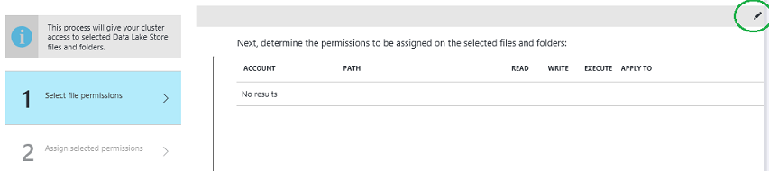
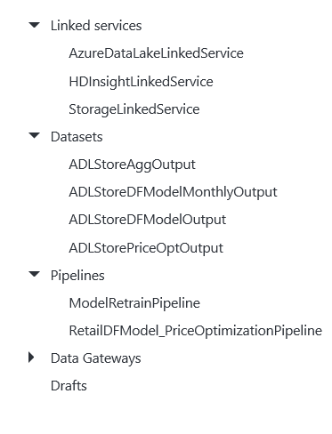
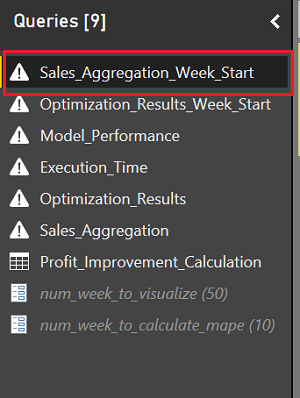
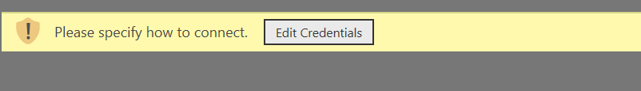
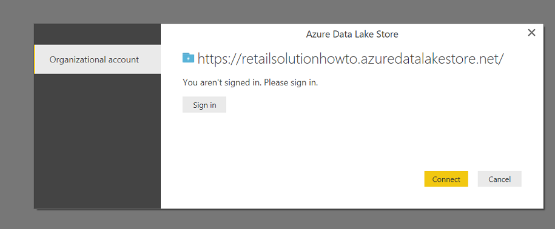
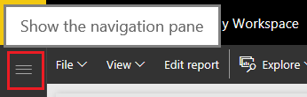
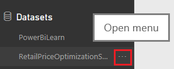
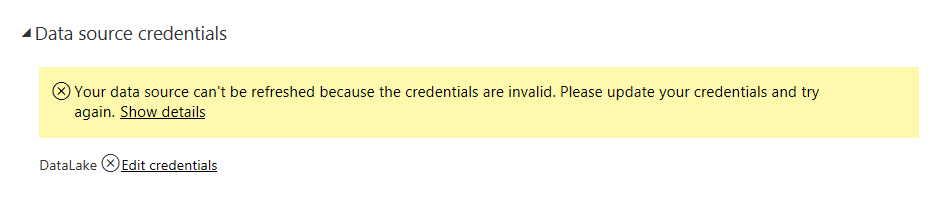

# Retail Demand Forecasting and Price Optimization Solution in Cortana Intelligence Suite

## Table of Contents  
- [Abstract](#abstract)  
- [Requirements](#requirements)
- [Architecture](#architecture)
- [Setup Steps](#setup-steps)
- [Scale-Up the Solution](#optional-scale-up-the-solution)


## Abstract

Pricing has grown to become an overwhelming task for many retailers due to ever-expanding product assortments. One of the greatest advantages of the information explosion era is that vast troves of historical transaction data, containing rich information about price elasticity and various potential drivers for demand, are available to be utilized for a better and more efficient pricing strategy. This opportunity comes with several challenges: How can the insights in this large volume of data be identified and leveraged? What analytical approach should be taken to optimize the price? How can the pricing task be operationalized for scheduled performance? And how can the solution be validated properly? 

The solution provided here addresses the challenges raised above by utilizing historical transaction data to train a demand forecasting model that predicts the impact of store, department, brand, and product attributes, including the pricing of products in a competing group, on demand and sales rates. A price optimization algorithm can then employ the model to forecast demand at various candidate price points, choosing the combination which maximizes profit. The whole process described above is operationalized and deployed in the Cortana Intelligence Suite.

This solution will enable retailers to ingest their own data  and obtain optimal pricing recommendations on a regular basis, improve profitability, and reduce the time and effort of pricing tasks.

## Requirements

You will need the following accounts and software to create this solution:

- Source code and instructions from this GitHub repo (Download/Clone)

- A [Microsoft Azure subscription](<https://azure.microsoft.com/>) 

- A Microsoft Office 365 subscription for Power BI access

- A network connection

- [Microsoft Azure Storage Explorer](<http://storageexplorer.com/>)

- [Power BI Desktop](<https://powerbi.microsoft.com/en-us/desktop>)

It will take about four to five hours to implement this solution if you have all the required software/resources ready to use. 

## Architecture


The figure above shows the overall architecture of the Retail Price Optimization solution. Here is the explanation :

- **Data Sources** : The solution uses a python application for generating simulated retail data. This application runs on Spark (not distributed) and writes the raw data on Azure Blob Storage.

- **Ingest** : Raw data is copied from Azure Blob Storage to Azure Data Lake Storage, which is the Big Data storage in this solution 

- **Prepare** : A Spark job reads the raw data from Azure Data Lake Storage and process/prepare it for the next steps

- **Analyze** : It has two parts :
  - First Spark Job uses the processed data to train the Retail Demand Forecasting model
  - Second Spark Job solves the Price Optimization problems and outputs the recommended optimal prices  

- **Publish** : The results of both Retail Demand Forecasting and Price Optimization are stored on Azure Data Lake Store

- **Visualize** : Power BI is used to visualize the results

- **Pipeline Scheduling** : Azure Data Factory is used to create and schedule the pipelines involving all the above mentioned activities


## Setup Steps
This section walks the readers through the creation of each of the Cortana Intelligence Suite services in the architecture defined in Figure 1.
As there are usually many interdependent components in a solution, Azure Resource Manager enables you to group all Azure services in one solution into a [resource group](https://azure.microsoft.com/en-us/documentation/articles/resource-group-overview/#resource-groups). Each component in the resource group is called a resource.
We want to use a common name for the different services we are creating. The remainder of this document will use the assumption that the base service name is:

retailtemplate\[UI\]\[N\]

Where \[UI\] is the users initials and N is a random integer that you choose. Characters must be entered in in lowercase. Several services, such as Azure Storage, require a unique name for the storage account across a region and hence this format should provide the user with a unique identifier.
So for example, Steven X. Smith might use a base service name of *retailtemplatesxs01*  

**NOTE:** We create most resources in the South Central US region. The resource availability in different regions depends on your subscription. When deploying you own resources, make sure all data storage and compute resources are created in the same region to avoid inter-region data movement. Azure Resource Group and Azure Data Factory don’t have to be in the same region as the other resources. Azure Resource Group is a virtual group that groups all the resources in one solution. Azure Data Factory is a cloud-based data integration service that automates the movement and transformation of data. Data factory orchestrates the activities of the other services. Use same subscription to deploy all the mentioned resources.


### 1. Create a new Azure Resource Group

  - Navigate to ***portal.azure.com*** and log in to your account

  - On the left tab click ***Resource Groups***
  
  - In the resource groups page that appears, click ***Add***
  
  - Provide a name ***retailtemplate\_resourcegroup***
  
  - Select a ***location***. Note that resource group is a virtual group that groups all the resources in one solution. The resources don’t have to be in the same location as the resource group itself.
  
  - Click ***Create***


### 2. Setup Azure Data Lake Store

- Navigate to ***portal.azure.com*** and log in to your account

- Click **NEW**, click **Storage**, and then click **Data Lake Store**. 

- Set the name to ***retailtemplate[UI][N]***

- Set the resource group to the **retailtemplate\_resourcegroup** which we created, by selecting the radio button ***Use existing***

- Click **Create** in the bottom left corner of the blade

Now that the Azure Data Lake Store has been created we need to collect some information about it for other services like Azure Data Factory. 

  - Navigate to ***portal.azure.com*** and log in to your account

  - On the left tab click Resource Groups

  - Click on the resource group we created earlier ***retailtemplate_resourcegroup***. If you don’t see the resource group, click ***Refresh*** 

  - Click on the Data Lake Store in Resources

  - From the new blade (window) under *Overview*, copy the *ADL URI* and *URL* and store it in below table

    | **Azure Data Lake Store** |                     |
    |------------------------|---------------------|
    | DataLakeStore Name     |retailtemplate\[UI][N]|
    | DataLakeStore URL      |             |
    | DataLakeStore URI     |             ||


### 3. Setup Azure Storage account

An Azure Storage account is used by the Data Simulator to write raw data and by Spark to use as Primary Storage. 

  - Navigate to ***portal.azure.com*** and log in to your account

  - On the left tab click ***+ (New) > Storage > Storage Account***

  - Set the name to ***retailtemplate[UI][N]***

  - Change the ***Deployment Model*** to ***Classic***

  - Set the resource group to the resource group we created by selecting the radio button ***Use existing***

  -  Location set to South Central US
	
  - Click ***Create***

  - Wait for the storage account to be created

Now that the storage account has been created we need to collect some information about it for other services like Azure Data Factory. 

  - Navigate to ***portal.azure.com*** and log in to your account

  - On the left tab click Resource Groups

  - Click on the resource group we created earlier ***retailtemplate_resourcegroup***. If you don’t see the resource group, click ***Refresh*** 

  - Click on the storage account in Resources

  - In the Settings tab on the right, click ***Access Keys***

  - Copy the Primary Connection String and add it to the table below

  - Copy the Primary Access Key and add it to the table below

    | **Azure Storage Account** |                     |
    |------------------------|---------------------|
    | Storage Account Name        |retailtemplate\[UI][N]|
    | Primary Connection String      |             |
    | Primary Access Key     |             ||


### 4. Setup HDInsight with Spark

- Navigate to ***portal.azure.com*** and log in to your account

- On the left tab click ***New > Intelligence + analytics > HDInsight***

- Set the cluster name to ***retailtemplate[UI][N]***

- Click on ***Cluster configuration*** and select following in the new opened blade(panel) :
    - Cluster Type : Spark
    - Operating System : Linux
    - Version : Spark 1.6.2 (HDI 3.4)
    - Cluster Tier : Standard
    - Click ***Select*** at the left bottom of the blade

- Click on ***Credentials*** and provide following information on the new opened blade :
    - Cluster Login Username : \<admin/or whatever you want>
    - Cluster Login Password : \<cluster password>
    - SSH Username : \<secure Shell login username>
    - SSH Password : \<SSH password>
    - Save the credentials in the table mentioned later in this section
    - Click ***Select*** at the bottom-left of the blade

- Click on ***Data Source*** and provide following information on the new opened blade :
    - Select storage account : Select the Storage Account we created in step 3 
    - Choose Default Container : **retailtemplate**
    - Click on ***Cluster AAD Identity*** 
    
      Here we set the permission to allow Spark Cluster to access the Azure DataLakeStore data. If you want some clarification on below steps, you can follow this document : [Create an HDInsight cluster with Data Lake Store using Azure Portal](https://docs.microsoft.com/en-us/azure/data-lake-store/data-lake-store-hdinsight-hadoop-use-portal)
    
      On the new opened blade :
       - Select AD Service Principal : Create New
       - Service Principal :
         - Service Principal Name : retailtemplate\[UI][N]
         - Certificate password/Confirm Password : \<provide password>
         - Click ***Create*** on the left bottom
       - Click on **Manage ADLS Access**
         - Click on the first step, **Select file permissions**, in the new opened blade
            - Click on the edit icon circled in the below image and the click on 
            
            - On clicking the Edit icon, you will see the Edit icon changing to an arrow icon. Click on the typing area on left of the arrow. Begin typing the name of the Azure Data Lake Store you created earlier (***retailtemplate[UI][N]***), and the result should appear in a drop-down list of available Data Lake Stores under your subscription, as shown in the image below.
            
            - If you do not see the ADL Store in the drop-down list, enter ***"adl://\<AzureDataLakeStore-name>.azuredatalakestore.net/"*** (with the Azure Data Lake Store name we created in step 2) and press Enter.
            - Click the check-box to the left of the Data Lake Store we created in Step 2, and then click **Select**.
         - Click on the second step, **Assign selected permissions**. Click **Run** on the new opened blade and Click **Done** once run completes
        - Click on **Done** 
    - Click ***Select*** on the left bottom

- Click on ***Pricing*** and select following on the new opened blade :
  - Number of Worker nodes : 2 
  - Worker Node Size : Select **D12 V2 Optimized**
  - Head Node Size : D12 V2 (2 nodes, 8 cores) - Default
  - Click ***Select*** on the left bottom
  
  **Note** : We have selected low configuration spark to save the cost of the solution as the data size for this solution is not big initially. Spark Custer can be scaled up when the data size is huge.

- Set the resource group to **retailtemplate\_resourcegroup** (which we created earlier) by selecting the radio button ***Use existing***

- Click ***Create*** to initiate the deployment of Spark HDInsight cluster. This can take 15 - 20 mins to complete

- While the cluster is being deployed, you can collect following information :
  - Navigate to the Spark Cluster under **retailtemplate\_resourcegroup** 
  - Under **Overview** copy the **URL** and update it in the table below
  - Click on **Secure Shell (SSH)** and copy the **Host Name** and update in the below table

| **Spark on HDInsight** |                     |
|------------------------|---------------------|
| Cluster Name        |retailtemplate\[UI][N]|
| Cluster Login Username     |             |
| Cluster Login Password     |             |
| SSH Username     |             |
| SSH Password     |             |
| Cluster URI     |https://\<cluster-name>.azurehdinsight.net             |
| Host Name     |\<cluster-name>-ssh.azurehdinsight.net             |
| 


### 5. Update Script Files

#### 1. Update Retail Data Simulator Job

Data Simulator Job (RetailDataSimulator.py) is a python application which generates the simulated retail sales data and writes it to Blob Storage. This job is run/scheduled in the pipeline *RetailDataSimulatorPipeline*. Pipeline explanation and steps to create them are covered in step 8. 
  - Go to the folder **"Manual Deployment Guide\Scripts\Data Simulator Job"** inside the downloaded GIT repo
  - Open the file **RetailDataSimulator.py** in text editor
  - Provide following parameters on line **36** and **37** which we have recorded in table under Step 3:
    - storage_account_name = "\<Storage-Account-Name>"
    - storage_account_key = "\<Storage-Account-Primary-Access-Key>"
  - Save the file and close it


#### 2. Update Package Installer Script

Package Installer script (packageInstaller.sh) is used to install required python packages on Spark Cluster. Steps on how to use it will be covered in later section.
- Go to the folder **"Manual Deployment Guide\Scripts\Package Installer"** inside the downloaded GIT repo
- Open the file **packageInstaller.sh** in text editor
- On line number **9**, replace the **\<Storage-Account-Name>** with the one we created in step 3


#### 3. Update the Spark Jobs

There are five different spark jobs, each performs a different task. All the Spark jobs are written in PySpark.

##### 1. Spark Job Sales_Data_Aggregation
This Spark job turns unstructured transactional raw data in Json format to structured csv format, and also aggregates individual transactions to weekly sales data at store level for every run of the pipeline *RetailDFModel_PriceOptimizationPipeline*.
- Go to the folder **"Manual Deployment Guide\Scripts\PySpark Job"** inside the downloaded GIT repo
- Open the file **Sales_Data_Aggregation.py** in text editor
- On line number **54**, replace the adl_name **\<Azuredatalakestore-Name>** with the one we created in step 2

##### 2. Spark Job Demand_Forecasting_Model_Training_First_Time_Pipeline
This Spark job conducts feature engineering and demand forecasting model training only for the first run of the pipeline *RetailDFModel_PriceOptimizationPipeline*, when there is no forecasting model available for price optimization. 
- Go to the folder **"Manual Deployment Guide\Scripts\PySpark Job"** inside the downloaded GIT repo
- Open the file **Demand_Forecasting_Model_Training_First_Time_Pipeline.py** in text editor
- On line number **49**, replace the adl_name **\<Azuredatalakestore-Name>** with the one we created in step 2

##### 3. Spark Job Demand_Forecasting_Model_Training_Pipeline

- Go to the folder **"Manual Deployment Guide\Scripts\PySpark Job"** inside the downloaded GIT repo
- Open the file **Demand_Forecasting_Model_Training_Pipeline.py** in text editor
- On line number **49**, replace the adl_name **\<Azuredatalakestore-Name>** with the one we created in step 2

##### 4. Spark Job Price_Optimization
This Spark job perform price optimization for stores in treatment group for every run of the pipeline *RetailDFModel_PriceOptimizationPipeline*. To validate the performance of the price optimization algorithm, stores are divided into control and treatment group. Stores in treatment group accepts the recommended optimal price from optimization algorithm every week, whereas stores in control group using random price strategy every week.  
- Go to the folder **"Manual Deployment Guide\Scripts\PySpark Job"** inside the downloaded GIT repo
- Open the file **Price_Optimization.py** in text editor
- On line number **249**, replace the adl_name **\<Azuredatalakestore-Name>** with the one we created in step 2

##### 5. Spark Job Powerbi_Processing
This Spark job prepares the result to be displayed in PowerBI for every run of the pipeline *RetailDFModel_PriceOptimizationPipeline*
- Go to the folder **"Manual Deployment Guide\Scripts\PySpark Job"** inside the downloaded GIT repo
- Open the file **Powerbi_Processing.py** in text editor
- On line number **22**, replace the adl_name **\<Azuredatalakestore-Name>** with the one we created in step 2


### 6. Prepare the storage account
-	Download and install the [Microsoft Azure Storage Explorer](http://storageexplorer.com/)
-	Open Azure Storage Explorer and log in to your Microsoft account associated with your Azure Subscription
-	Locate the storage account created in step 2 above and expand the nodes to see *Blob Containers*, etc.
-	Create two containers named *adflibs* and *actionscript* 

	1.	Right click on ***Blob Containers*** and choose ***Create Blob Container***
	2.	Enter the container's name as *adflibs*
	3.  	Repeat steps (i) and (ii) to create another container with name *actionscript*

-	Right click the *adflibs* container and choose ***Open Blob Container Editor***
-	In the right panel, above the container listing, click the arrow on the ***Upload*** button and choose ***Upload Files***
-	Browse to the ***Manual Deployment Guide\Scripts\PySpark Job*** folder inside the downloaded GIT repo, select all the files including **com.adf.sparklauncher.jar** and click **Upload**. This will upload the required Spark Jobs.
-	Browse to the ***Manual Deployment Guide\Scripts\Data Simulator Job*** folder inside the downloaded GIT repo, , select the file **RetailDataSimulator.py** and click **Upload**. This will upload the required Data Simulator Job.

Now upload the Package installer scripts/files similarly:
-	Double-click on the *actionscript* container.
-	In the right panel, above the container listing, click the arrow on the ***Upload*** button and choose ***Upload Files***.
-	Browse to the ***Manual Deployment Guide\Scripts\Package Installer*** folder inside the downloaded GIT repo, select all the files and click **Upload**. This will upload the files required to update spark cluster python packages.
- Right-click on container *actionscript* and select **Set Public Access Level**.
- Select the radio button with **Public read access for container and blobs** and click **Apply**. This is done to make the package installer files accessible by Spark.
- Right click on the **packageInstaller.sh** in the container *actionscript* and select **Copy URL to Clipboard**. Save the URL in the table below.   

  | **Package Installer on Blob Storage** |                     |
  |------------------------|---------------------|
  | packageInstaller.sh URL        | \<URL>||

### 7 Update Spark Cluster Python Packages

We need to update/install some python packages to run the Spark Web Jobs and Data Simulator successfully. We will use the Package installer script to do so.

- Navigate to ***portal.azure.com*** and log in to your account.

- On the left tab, click **Resource Groups**.

- Click on the resource group we created earlier, ***retailtemplate\_resourcegroup***.

- Click on the HDInsight Spark Cluster we created in step 4.

- Under **CONFIGURATION**, select **Script Actions**.

- Add a new Script Action by clicking on the **Submit New** on top of the new opened blade:
  - Name : Package Installer
  - Bash script URI : \<packageInstaller.sh URL recorded in step 6>
  - **Head** and **Worker** should be checked
  - Check **Persist this script action to rerun when new nodes are added to the cluster** at the bottom
  - Click **Create** and let the script run complete


### 8 Setup Azure Data Factory (ADF)
Azure Data Factory can be used to orchestrate the entire data pipeline. In this solution, it is mainly used to schedule the data simulation, aggregation, demand forecasting and price optimization. Here is an overview of the ADF pipelines.

> **Note**: In the demo here, ADF is scheduled to simulate, process, and output the results for **one week's** data **in one hour**. That is to say, in this solution demo, one week is condensed to one hour. In this case, you are able to view multiple weeks' results in a few hours, rather than waiting for multiple weeks to get the results for a few weeks. However, in the reality deployment, the ADF cycle time should be consistent with the real time.

**RetailDataSimulatorPipeline**: Raw data for each week are simulated and sent to Azure Blob Storage in each cycle.  

**RetailDFModel_PriceOptimizationPipeline**: In each cycle, raw data are copied from Azure Blob Storage to Azure Data Lake Store. Then, Spark activities will ingest the raw data from Azure Data Lake Store, aggregate the raw unstructured transaction data to weekly sales data, train demand forecasting model, solve price optimization problems and prepare the data for Power BI visualization in each cycle.

**ModelRetrainPipeline**: Demand forecasting model is retrained on up-to-date sales data to keep improving the predictive performance. The **ModelRetrainPipeline** can be deployed in a different cycle time from the two pipelines above, since there are no dependencies between **ModelRetrainPipeline** and the other two pipelines. In this solution demo, the **RetailDataSimulatorPipeline** and **RetailDFModel_PriceOptimizationPipeline** are scheduled to run **hourly**, which represents **weekly** in the reality. While **ModelRetrainPipeline** is scheduled to run **every four hours**, which represents **four weeks (approximately one month)** in the reality.

There are 3 main components of ADF: link service, dataset and pipeline. You can check the definition of each components [here](https://azure.microsoft.com/en-us/documentation/articles/data-factory-introduction/). In the following instructions, we will show you how to create them for this solution.

#### 1. Create Azure Data Factory


- Navigate to ***portal.azure.com*** and log in to your account.

- On the left tab, click ***+ (New) > Intelligence + analytics > Data Factory*** and select the following options:

  -   Name: *retailsolution\[UI\]\[N\]*

  -   Resource Group: Choose the resource group created previously ***retailtemplate\_resourcegroup***

  -   Location: EAST US

  -   Click ***Create***

After the data factory is created successfully:

-   On the left tab in the portal page (portal.azure.com), click ***Resource groups***.

-   Search for the resource group created previously, ***retailtemplate\_resourcegroup***.

-   Under Resources, click on the data factory we just created, **retailsolution\[UI\]\[N\]**.

-   Click on ***Author and deploy*** in the new blade.

In the ***Author and deploy*** blade, we will create all the components of the data factory. Note that Datasets are dependent on Linked Services, and Pipelines are dependent on Linked Services and Datasets. Therefore, we will create Linked Services first, then Datasets, and finally Pipelines.


#### 2. Create Linked Services
We will create three Linked Services in this solution. The scripts of the Linked Services are located in the folder ***Scripts\Azure Data Factory\Linked Services*** of the solution package.

- **StorageLinkedService**: This is the Linked Service for the Azure Storage Account.

  -   Open the file ***Manual Deployment Guide\Scripts\Azure Data Factory\Linked Services\StorageLinkedService.json***. Under **connectionString** replace the following items with your Azure Storage credentials.
    - AccountName=\<Replace with Storage Account Name noted in step 3>
    - AccountKey=\<Replace with Primary Access Key noted in step 3>
  -   Go back to ***Author and deploy*** in the data factory on ***portal.azure.com***.
  -   Click ***New data store*** and select ***Azure Storage***.
  -   Overwrite the content in the editor window with the content of the modified *StorageLinkedService.json*.
  -   Click ***Deploy***.

- **HDInsightLinkedService**: This is the Linked Service for the Azure HDInsight cluster running Spark.

  -   Open the file ***Manual Deployment Guide\Scripts\Azure Data Factory\Linked Services\HDInsightLinkedService.json***. Replace the following items with HDInsight with Spark information you recorded in step 4.
    - clusterUri : "\<Replace With Cluster URI recorded in step 4>"
    - userName : "\<Replace with Cluster Login Username recorded in step 4>"
    - password : "\<Replace with Cluster Login Password recorded in step 4>"
  -   Go back to ***Author and deploy*** in the data factory on ***portal.azure.com.***
  -   Click ***...More*** then ***New compute*** and select ***HDInsight cluster***.
  -   Overwrite the content in the editor window with the content of the modified *HDInsightLinkedService.json*.
  -   Click ***Deploy***.

- **AzureDataLakeLinkedService**: This is the Linked Service for the Azure Data Lake Store.

  -   Open the file ***Manual Deployment Guide\Scripts\Azure Data Factory\Linked Services\AzureDataLakeLinkedService.json***. Replace the following items with Azure Data Lake Store information you recorded in step 2.
    - dataLakeStoreUri : "https://\<Replace-with-DataLakeStore-Name-noted-in-step-2>.azuredatalakestore.net/webhdfs/v1"
  -   sessionId and authorization will be updated automatically once you authorize this linked service.
  -   Go back to ***Author and deploy*** in the data factory on ***portal.azure.com.***
  -   Click ***New data store*** and select ***Azure Data Lake Store***.
  -   Overwrite the content in the editor window with the content of the modified *AzureDataLakeLinkedService.json*.
  -   Click on the **Authorize** which will appear on top left corner of the editor (as shown in the image below):
  
  -   This will open a new window. Provide your Microsoft credentials to authorize.
  -   Once you authorize, it will update the remaining parameters of this linked service.
  -   Click ***Deploy***.


#### 3. Create Datasets

We will create 10 ADF datasets pointing to Azure Storage and Azure DataLakeStore. We will use the JSON files located at ***Scripts\Azure Data Factory\Datasets***. No modification is needed on the JSON files.

- On ***portal.azure.com*** navigate to your data factory and click the ***Author and Deploy*** button.

For each JSON file under ***Manual Deployment Guide\Scripts\Azure Data Factory\Datasets***:
-   At the top of the left tab, click ***New dataset*** and select ***Azure Blob Storage***.
-   Copy the content of the file into the editor.
-   Click ***Deploy***.


#### 4. Create Pipelines

We will create 3 pipelines in total using the JSON files located at ***Manual Deployment Guide\Scripts\Azure Data Factory\Pipelines***. At the bottom of each JSON file, the “start” and “end” fields identify when the pipeline should be active (in UTC time). You will need to modify the start and end time of each file to customize the schedule. For more information on scheduling in Data Factory, see [Create Data Factory](https://azure.microsoft.com/en-us/documentation/articles/data-factory-create-pipelines/) and [Scheduling and Execution with Data Factory](https://azure.microsoft.com/en-us/documentation/articles/data-factory-scheduling-and-execution/). We also need to update the **\<Storage-Account-Name>** in these pipelines with the name we recorded in step 3.

- **RetailDataSimulatorPipeline**

  This pipeline runs the DataSimulator Job on Spark every hour.

  - Open the file ***Manual Deployment Guide\Scripts\Azure Data Factory\Pipelines\RetailDataSimulatorPipeline.json***.
  - On line **14** replace the **\<Storage-Account-Name>** with the **Storage Account Name** we created in step 3.
    - This is how the edited line should look like: ***"wasb://adflibs@retailsolutionhowto.blob.core.windows.net/RetailDataSimulator.py"*** where ***retailsolutionhowto*** is the sample Storage Account Name
  - Specify an active period that you want the pipeline to run. You need to put the current date and time of one hour past. This date and time should be in UTC time. For example, if current UTC Datetime is **2016-11-22T17:08:00Z** i.e. 22nd Nov 2016 17:08, you need to put the start time one previous hour window, that is 16:00 - 17:00. Which means your pipeline start time will be **2016-11-22T16:00:00Z**. End time can be a week ahead **2016-11-29T16:00:00Z** (you can set it to few days or even few hours to save cost). Update the start and end date near the bottom of pipeline JSON file.

    ```JSON
    "start": "2016-11-22T16:00:00Z",
    "end": "2016-11-29T16:00:00Z",
    ```
    **Note**: Please limit the active period to the amount of time you need to test the pipeline to limit the cost incurred by data movement and processing.

  - On ***portal.azure.com*** navigate to your data factory and click the ***Author and Deploy*** button.
  - At the top of the tab, click ***...More*** and then ***New pipeline***.
  - Copy the content of the modified JSON file into the editor.
  - Click ***Deploy***.


- **ModelRetrainPipeline**

  This pipeline runs the Demand Forecasting model retrain Job on Spark every four hours.

  - Open the file ***Manual Deployment Guide\Scripts\Azure Data Factory\Pipelines\ModelRetrainPipeline.json***.
  - On line **14** replace the **\<Storage-Account-Name>** with the **Storage Account Name** we created in step 3.
  - Set the activity perior to be half hour ahead of the RetailDataSimulatorPipeline. If RetailDataSimulatorPipeline start datetime is  **2016-11-22T16:00:00Z** then for ModelRetrainPipeline it should be half an hour ahead, i.e.  **2016-11-22T16:30:00Z**. End time should be half an hour ahead of end time of RetailDataSimulatorPipeline, i.e.  **2016-11-29T16:30:00Z**. Update the start and end date at the bottom of pipeline JSON.

    ```JSON
    "start": "2016-11-22T16:30:00Z",
    "end": "2016-11-29T16:30:00Z",
    ```
  - On ***portal.azure.com***, navigate to your data factory and click the ***Author and Deploy*** button.
  - At the top of the tab, click ***...More*** and then ***New pipeline***.
  - Copy the content of the modified JSON file into the editor.
  - Click ***Deploy***.


- **RetailDFModel_PriceOptimizationPipeline**

  This pipeline runs every hour. In each cycle, raw data are copied from Azure Blob Storage to Azure Data Lake Store. Then, Spark activities will ingest the raw data from Azure Data Lake Store, aggregate the raw unstructured transaction data to weekly sales data, train demand forecasting model, solve price optimization problems and prepare the data for Power BI visualization in each cycle.

  - Open the file ***Manual Deployment Guide\Scripts\Azure Data Factory\Pipelines\RetailDFModel_PriceOptimizationPipeline.json***
  - On line **84**, **123**, **159** and **195** replace the **\<Storage-Account-Name>** with the **Storage Account Name** we created in step 3
  - The Start and End date for this pipeline should be exactly same as that of RetailDataSimulatorPipeline:

    ```JSON
    "start": "2016-11-22T16:00:00Z",
    "end": "2016-11-29T16:00:00Z",
    ```
  - On ***portal.azure.com*** navigate to your data factory and click the ***Author and Deploy*** button.
  - At the top of the tab, click ***...More*** and then ***New pipeline***.
  - Copy the content of the modified JSON file into the editor.
  - Click ***Deploy***.

Here is how your ADF configurations should look after finishing above steps:


> **Note** :Once all the pipelines are deployed, the model will generate results for the first one hour, i.e. for duration **16:00 - 17:00** in the above example. With the provided Data Simulator job configuration, the model takes around 10-15 minutes to complete the first run. 


### 9. Setup Power BI

The essential goal of this part is to visualize the results from the retail price optimization solution. Power BI can directly connect to an Azure Data Lake as its data source, where the results are stored.
> **Note**:  1) In this step, the prerequisite is to download and install the free software [Power BI desktop](https://powerbi.microsoft.com/desktop). 2) We recommend you start this process 2-3 hours after you finish deploying the ADF pipelines so that you have more data points to visualize.

#### 1.	Download the Power BI report file and sign-in 

-  Make sure you have installed the latest version of [Power BI desktop](https://powerbi.microsoft.com/desktop).
-	In this GitHub repository, you can download the **'RetailPriceOptimizationSolution.pbix'** file under the folder [*Power BI*](https://github.com/Azure/cortana-intelligence-retail-price-optimization/tree/master/Manual%20Deployment%20Guide/Power%20BI) and then open it. **Note:** If you see an error massage, please make sure you have installed the latest version of Power BI Desktop.
- After opening the **'RetailPriceOptimizationSolution.pbix'** file, you might see message saying "There are pending changes in your queries that haven't been applied.". Please **’do not Apply Changes’** since the data source has not been updated yet. 
-	Sign in with the same Microsoft account that you have been used for deploying the previous steps by clicking **’Sign in’** on the top-left corner. Note: You must have a Microsoft Office 365 subscription for Power BI access.
-	Click on **’Edit Queries’** on the top and open the query editor. You will see 9 Queries in the left pane of the query editor. You might also see an error message saying "DataFormat.Error: Invalid URI". Please ignore this error message for now and follow the below instructions for updating the data source. Once the data source is updated, the error will gone.

#### 2.	Update the Azure Data Lake Store account of the Power BI file

-	Click on **’Sales_Aggregation_Week_Start’** query and you will see that this query is highlighted in a darker color as the following screenshot. Then, click on the **’Advanced Editor’** on the top, which is next to the **’Refresh Preview’**.



-	On the popped-out Advanced Editor window, replace the **\<DataLakeStore-Name>** on the first line with the name of the Azure Data Lake Store that you deployed in the previous steps. 
- Then, click **’Done’** on the bottom-right corner of the Advanced Editor window.
-	Then you will see a message saying “Please specify how to connect.”. Click on **’Edit Credentials’**.



-	Then you will be asked to Sign in again. Click on **’Sign in’** and Sign in again with the same Microsoft account as previous. After successfully signed in, you will see the message saying “You are currently sighed in.” Then, click on **’Connect’** highlighted in yellow.



-	If the connection is successful, you can see the data appears similar as the following snapshot.


-	Repeat the first 2 steps that you did for **’Sales_Aggregation_Week_Start’** query (click on the corresponding query, open the corresponding advanced query editor and replace the **\<DataLakeStore-Name>** with your Data Lake Store name) on the following 5 other queries: **’ Optimization_Results_Week_Start’** query, **’ Model_Performance’** query, **’ Execution_Time’** query, **’ Optimization_Results’** query, **’ Sales_Aggregation’** query. 
-	Click on **’Close & Apply’** on the top-left, and you will see the visualization report in Power BI Desktop. 


-	[Optional] You can click on **’Refresh’** on the top anytime you want to refresh the report, when there are new data comes in.


#### 3)	[Optional] Publish the dashboard to [Power BI online](http://www.powerbi.com/)

Note that this step needs a Power BI account (or Office 365 account).
-	 Click **’Publish’** on the top panel. Choose **'My Workspace'** and few seconds later a window appears displaying "Publishing succeeded".
-	Click the link on the screen to open it in a browser. 
-	Click on the “three-lines” button on the top-left corner to Show the navigation pane. 



-	On the navigation pane, go to the **’Datasets’** section, click on the “three dots” right to the **'RetailPriceOptimizationSolution'**, choose **’SCHEDULE REFRESH’**. 



-	If you see the following message in **’Data source credentials’**, click **’Edit credentials’** and sign in with your Microsoft account again.



-	Click on the **’Scheduled Refresh’** session, set the **’Keep your data up to date’** to **’yes’**. **’Refresh frequency’** to **’Daily’**. Click on **’Apply’**. Then this dataset will be refreshed daily as scheduled.
-	On the navigation pane, go to the **’Reports’** section, click on **’ RetailPriceOptimizationSolution’**. Click on **’Pin Live Page’** on the top. On the popped out window, choose **’New Dashboard’**, and put the name of the new dashboard, e.g RetailPriceOptimizationSolution, and click on **’Pin Live’**.
-	On the navigation pane, go to the **’Dashboards’** section, click on **’ RetailPriceOptimizationSolution’**. Click the three dots on the top-right of the dashboard tile (the red one). Click on the middle pencil icon to edit the tile details. In **’Functionality’**, check **’Display last refresh time’**, and click on **’Apply’**. You will see the last refresh time showing up on the top-left of the dashboard.


## [Optional] Scale-Up the Solution

The solution is configured to produce small dataset so that user does not have to wait for hours to see the results. If you would like to test this solution with larger dataset, this section will help you to do so.

To scale up the solution, we need to create a new Azure Data Factory and update the DataSimulator job parameters. Before that, we need to perform some cleanup. Follow the steps below:

### 1. Delete Azure Data Factory
  -   On the left tab in the ***portal.azure.com***, click ***Resource groups***
  -   Search for the resource group created previously, ***retailtemplate\_resourcegroup***
  -   Under Resources, click on the data factory we just created, **retailsolution\[UI\]\[N\]**
  -   Click **Delete** on top of the new opened blade, click Ok 

### 2. Cleanup the Folders in Azure Blob Storage
  -	Open Azure Storage Explorer and log in to your Microsoft account associated with your Azure Subscription
  -	Locate the storage account created in step 2 above and expand the nodes to see *Blob Containers*, etc.
  - Delete the containers named **rawdata**, **publicparameters** and **privateparameters** by Right clicking and selecting Delete


### 3. Cleanup the Folders in Azure DataLakeStore
  - Navigate to ***portal.azure.com*** and log in to your account
  - On the left tab click Resource Groups
  - Click on the resource group we created earlier ***retailtemplate\_resourcegroup***
  - Click on DataLakeStore we created in step 2
  - Under the section *Data Lake Store* select **Data Explorer**
  - You will see a list of folders on the new opened blade
  - Delete all the folders by doing a right click and then delete on individual folder

Once the cleanup is done, we need to update the DataSimulator job and recreate the Azure Data Factory. 

### 1. Change DataSimulator Job
You can scale up the data generation by changing following parameters for the DataSimulator job:
 - Go to the folder **"Manual Deployment Guide\Scripts\Data Simulator Job"** inside the downloaded GIT repo
  - Open the file **RetailDataSimulator.py** in text editor
  - Provide following parameters:
    - number_of_stores = 
    - number_of_brands = 
    - number_of_departments = 
    - number_of_weeks = 
    - storage_account_name = "\<Storage-Account-Name>"
    - storage_account_key = "\<Storage-Account-Primary-Access-Key>"
  - Save the file and close it

### 2. Upload the updated DataSimulator job to Blob Storage

-	Right click the *adflibs* container and choose ***Open Blob Container Editor***
-	In the right panel, above the container listing, click the arrow on the ***Upload*** button and choose ***Upload Files***
-	Browse to the ***Manual Deployment Guide\Scripts\Data Simulator Job*** folder inside the downloaded GIT repo, , select the file **RetailDataSimulator.py** and click **Upload**. This will upload the updated Data Simulator Job.

### 3. Setup Azure Data Factory (ADF)

This new ADF has all the Datasets and Pipeline which are configured to run every 24 hours (once a day). **Linked Services remains the same**. New Datasets and Pipeline can be found under the path **Manual Deployment Guide\Scripts\ScaleUp Solution-Azure Data Factory\**

#### 1. Create Azure Data Factory

  - Follow the instruction mentioned in step 8, section 1: **Create Azure Data Factory**

#### 2. Create Linked Services

- As the Linked Services remains same, use the Linked Services files which we updated earlier under the path **Manual Deployment Guide\Scripts\Azure Data Factory\Linked Services** 
- Follow the instruction mentioned in step 8, section 2: **Create Linked Services** and use the files under path mentioned in above step

#### 3. Create Datasets

- All the files for Datasets are under the path **Manual Deployment Guide\Scripts\ScaleUp Solution-Azure Data Factory\Datasets_ScaleUp**
- Follow the instruction mentioned in step 8, section 3: **Create Datasets** and use the files under path mentioned in above step

#### 4. Create Pipelines

- All the files for Datasets are under the path **Manual Deployment Guide\Scripts\ScaleUp Solution-Azure Data Factory\Pipelines_ScaleUp**
- Follow the instruction mentioned in step 8, section 4: **Create Pipelines** and use the files under path mentioned in above step


## Solution Resource Cost

## Deleting the Solution
If you want to delete the solution, select the resource group **retailtemplate\_resourcegroup**, click on **Delete** on top of the new opened blade. Confirm the resource group name and click **Delete** on the bottom on this blade.
