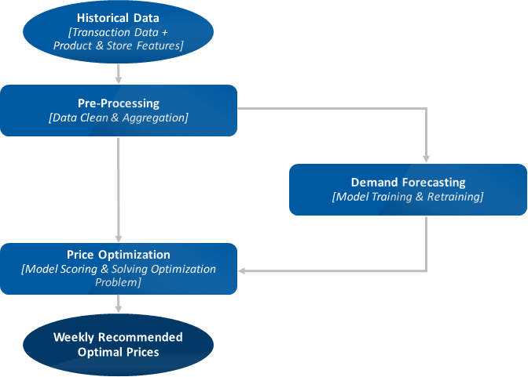

# Demand Forecasting and Price Optimization for Retail

## Analytical Approach
In this section, we provide more details about the analytical approach taken in the solution. The price optimization approach and algorithm used in this solution follows the method described by [Ferreira et al. (2015)](#refs).

### Approach Overview

The following chart provides a high-level illustration of the analytical approach taken in this solution. Raw data is cleaned and aggregated after ingestion into the pipeline. Demand forecasting models are trained and retrained regularly on the processed datasets. The price optimization algorithm will use the demand forecasting model to predict future demand at candidate price points within feasible ranges, and solve optimization problems (specifically mixed integer programming problems) to obtain the optimal prices.



### Demand Forecasting

The following driving factors for demand are considered in our demand forecasting model: 

1. Price-related features such as:
   - the actual sales price and cost
   - the discount of the price compared to MSRP (manufacturer’s suggested retail price), and
   - the relative price, the ratio between a product's price and the average price of all products in the same competing group.
2. Product attributes such as the brand desirability and department information.
3. Store attributes such as average traffic in the store, etc. 

A demand forecasting model is built on the features mentioned above. The model's performance is evaluated through mean absolute percentage error (MAPE). The model is retrained monthly, since continuously-acquired transaction data can be used to improve the demand forecasting accuracy and, consequently, the price optimization results.

### Price Optimization
A competing group contains similar products that are competing against each other on the market, thus price changes on one product will affect the sales of the other products in the same competing group. (Price changes for products from different competing groups are assumed to have no impact on one another's sales.) In this solution, prices are optimized by competing group: a single optimization problem is solved to determine optimal prices for all products in each competing group (cf. [Ferreira et al.](#refs) for additional details). 

While different retailers could vary a lot on how to define the competing group, this solution takes the definition of competing groups as sets of products sold in the same department and at the same store. As a result, different stores could price the same product differently in the solution, which corresponds to the reality that retailers could have different pricing or promotional strategies for different stores depending on various store attributes such as average traffic, store location, and store tier. 

During price optimization, each product's price is constrained to a feasible range bounded by the wholesale cost and manufacturer's suggested retail price (MSRP). Retailers may elect to tailor these constraints to their own business rules to reflect the differentiated pricing strategies they prefer for specific brands, departments, or stores.

A experiment is employed to evaluate the effect of price optimization strategy on profit. Stores are paired based on similarity and then divided into "treatment" and "control" groups. Stores in the treatment group accept the prices recommended by the optimization algorithm, whereas stores in the control group use the retailer's previous pricing strategy (which, in this demo scenario, is a randomized pricing strategy). The profit gain of the optimization approach can be estimated from the difference in profit between the treatment and control groups.

Different retailers may also follow different pricing change schedules, but as a starting example, this solution implements weekly price optimization.







