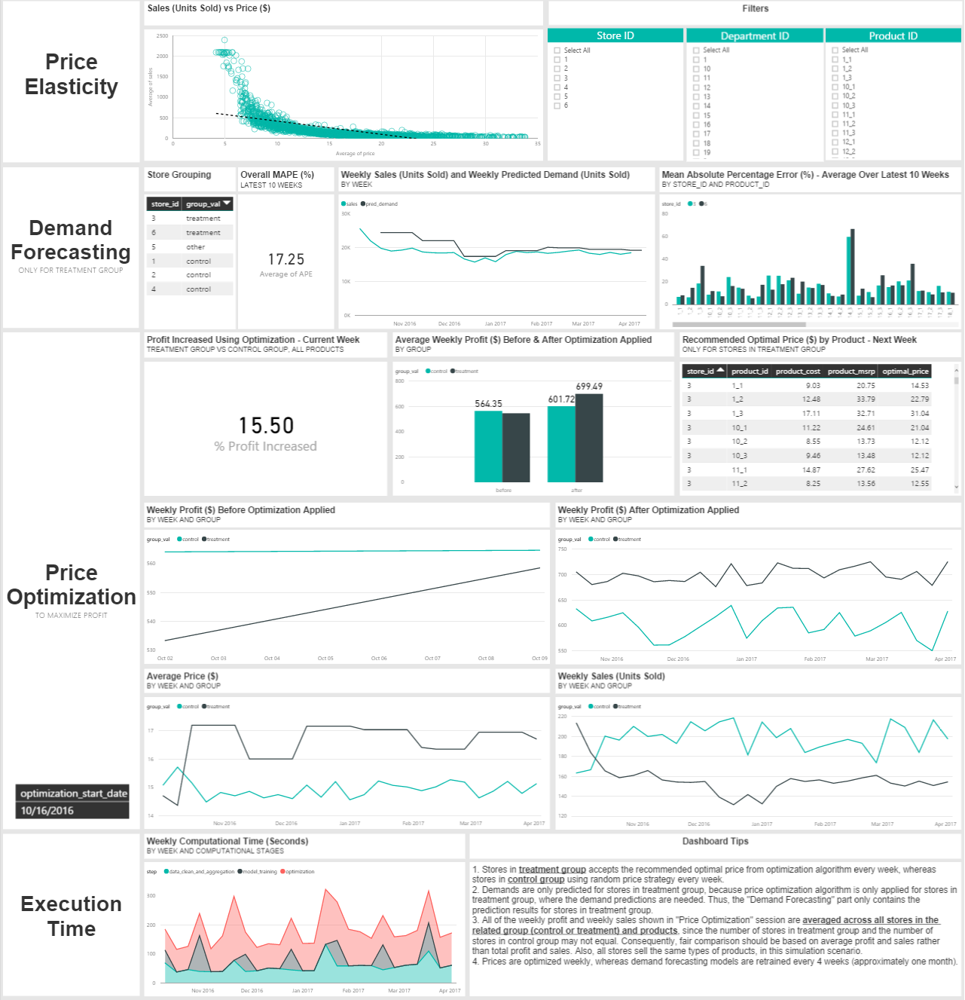

# Retail Demand Forecasting and Price Optimization Solution in Cortana Intelligence Suite

Pricing has grown to become an overwhelming task for many retailers due to ever-expanding product assortments. One of the greatest advantages of the information explosion era is that vast troves of historical transaction data, containing rich information about price elasticity and various potential drivers for demand, are available to be utilized for a better and more efficient pricing strategy. This opportunity comes with several challenges: How can the insights in this large volume of data be identified and leveraged? What analytical approach should be taken to optimize the price? How can the pricing task be operationalized for scheduled performance? And how can the solution be validated properly? 

The solution provided here addresses the challenges raised above by utilizing historical transaction data to train a demand forecasting model that predicts the impact of store, department, brand, and product attributes, including the pricing of products in a competing group, on demand and sales rates. A price optimization algorithm can then employ the model to forecast demand at various candidate price points, choosing the combination which maximizes profit. The whole process described above is operationalized and deployed in the Cortana Intelligence Suite.

This solution will enable retailers to ingest their own data  and obtain optimal pricing recommendations on a regular basis, improve profitability, and reduce the time and effort of pricing tasks.

## Analytical Approach
In this session, we provide more details about the analytical approach taken in the solution. The price optimization approach and algorithm used in this solution follows the method described by [Ferreira et al. (2015)](#refs).

### Demand Forecasting

The following driving factors for demand are considered in our demand forecasting model: 

1. Price-related features such as:
   - the actual sales price
   - the discount of the price compared to MSRP (manufacturer’s suggested retail price), and
   - the relative price, the ratio between a product's price and the average price of all products in the same competing group.
2. Product attributes such as the brand desirability and department information.
3. Store attributes such as average traffic in the store, etc. 

A decision tree model for demand forecasting is built on the features mentioned above. The model's performance is evaluated through mean absolute percentage error (MAPE). The model is retrained monthly, since continuously-acquired transaction data can be used to improve the demand forecasting accuracy and, consequently, the price optimization results.

### Price Optimization
A competing group contains similar products that are competing against each other on the market, thus price changes on one product will affect the sales of the other products in the same competing group. (Price changes for products from different competing groups are assumed to have no impact on one another's sales.) In this solution, prices are optimized by competing group: a single mixed integer optimization problem is solved to determine optimal prices for all products in each competing group (cf. [Ferreira et al.](#refs) for additional details). 

While different retailers could vary a lot on how to define the competing group, in this solution we define the competing groups as sets of products sold in the same department and at the same store. As a result, different stores could price the same product differently in the solution, which corresponds to the reality that retailers could have different pricing or promotional strategies for different stores with various store attributes such as average traffic, store location, and store tier. Different retailers may also follow different pricing change schedules, but as a starting example, this solution implements weekly price optimization.

## Solution Architecture
In this session, we provide more details about how the above analytical approach is operationalized in Cortana Intelligence Suite. The following chart describes the solution architecture.

### What’s Under the Hood
Raw simulated transactional data are pushed into Azure Data Lake Storage, whence the Spark Jobs run on HDInsight Cluster will take the raw data as inputs and:

1. Turn the unstructured raw data into structured data and aggregate the individual transactions into weekly sales data.
2. Train demand forecasting model on the aggregated sales data.
3. Run the optimization algorithm and return the optimal prices for all products in all competing groups.

The final results are visualized in Power BI Dashboard. The whole process is scheduled weekly, with data movement and scheduling managed by Azure Data Factory.

### About Implementation on Spark
A parallel version of the price optimization algorithm is implemented on Spark. Utilizing `RDD.map()`, the independent price optimization problems for products in different competing group can be solved in parallel, reducing runtime.

## Solution Dashboard
The snapshot below shows the Power BI dashboard that visualizes the results of retail price optimization. 

The dashboard contains four parts:
1. **Price Elasticity**: shows the relationship between sales and price, and using the filters on the right, you can select to view the results for a specific store, department or product.
2. **Demand Forecasting**: shows the results and performance of the demand forecasting model.
3. **Price Optimization** shows the profit gain realized by using the recommended optimal price, as well as corresponding changes in sales volume and price that resulted in the profit gain.
4. **Execution Time** shows the time decomposition of different computational stages, allowing the user to monitor the runtime.

## Getting Started

This solution template contains materials to help both technical and business audiences understand our price optimization solution for the retail industry built on the [Cortana Intelligence Suite](https://www.microsoft.com/en-us/server-cloud/cortana-intelligence-suite/Overview.aspx).

## Business Audiences

In this repository you will find a folder labeled **Solution Overview for Business Audiences**. This folder contains:
- Infographic: Covers the benefits of using advanced analytics for price optimization in the retail industry
- Solution At-a-glance: An introduction to a Cortana Intelligence Suite solution for retail price optimization
- Walking Deck: In-depth exploration of the solution for business audiences

For more information on how to tailor Cortana Intelligence to your needs, [connect with one of our partners](http://aka.ms/CISFindPartner).

## Technical Audiences

See the **Manual Deployment Guide** folder for a full set of instructions on how to deploy the end-to-end pipeline, including a step-by-step walkthrough and files containing all the scripts that you’ll need to deploy resources. **For technical problems or questions about deploying this solution, please post in the issues tab of the repository.**

## References
[1] Ferreira KJ, Lee BHA, and Simchi-Levi D. (2015). "Analytics for an online retailer: Demand forecasting and price optimization." *Manufacturing & Service Operations Management* **18** (1): 69-88. [doi:10.1287/msom.2015.0561](http://dx.doi.org/10.1287/msom.2015.0561)
